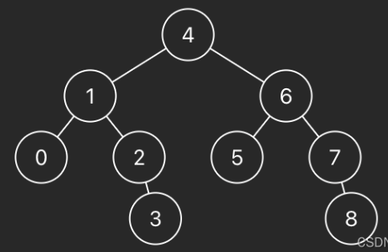

# 和控制台交互的输入输出

**整体的程序框架**需要自己导入常用的包, 并且类名 `public Class Main` 和主方法名 `public static void main(String[] args)` 需要留意

```java
import java.util.*;

public Class Main{
  public static void main(String[] args) {
    Scanner sc = new Scanner(System.in);
    
  }
}
```

**ACM输出**:

```java
System.out.print();
System.out.println();
```

**ACM 输入**分为几种情况:

1.   `sc.hasNext()` 可以判断接下来是否还有输入, 常用于程序没有指定输入行数的情况, 需要 `while(sc.hasNext())` 外层循环不断读取
2.   `sc.nextLine()` 可以读取本行的 String, 包括其末尾的回车; 其用法经常是:
     *   `int n = Integer.valueOf(sc.nextLine())`, 将本行读取到的 String 转换为数字
     *   `String[] ss = sc.nextLine().split(" ")`, 将本行读取到的 String 根据空格分割为 String 数组
     *   `sc.nextInt()`、`sc.nextLong()` 用于读取下一个 int 或 long 类型的数字, 但是**不能读取末尾的回车**

==注意==:

1.    当碰到先读取数字, 然后又读取一行字符串的情况:

     ```java
     5
     c d a bb e
     ```

      我们想要读取这两行的数据, 当采用下面的读法, `String s` 读出来的是空字符, 因为 `nextInt()` 仅仅读取到了 5, 但是没有把后面的回车换行符读进去, 留在了缓存区里面; 然后 `sc.nextLine()` 读取到了回车符, 出现错误

     ```java
     int n = sc.nextInt();
     String s = sc.nextLine();
     ```

     我们可以用多加一行 `sc.nextLine();` 读取掉换行符

     ```java
     int n = sc.nextInt();
     sc.nextLine();
     String s = sc.nextLine();
     ```

     或者更推荐的做法是, 直接用 `int n = Integer.parseInt(sc.nextLine());` 或者 `int n = Integer.valueOf(sc.nextLine());` 连带回车符一起读取

     ```java
     int n = Integer.valueOf(sc.nextLine());
     String s = sc.nextLine();
     ```


# 构建数据结构

## 数组

字符串转换为数组

输入:

```java
[2,7,11,15]
```

实现代码:

```java
import java.util.*;

public class Main {
  public static void main(String[] args) {
    Scanner sc = new Scanner(System.in);
    String input = sc.nextLine();
    
    int[] res = StringToIntArray(input);
    
    System.out.println(Arrays.toString(ans));
  }
  
  public static int[] StringToIntArray(String s) {
    String[] elements = s.substring(1, s.length() - 1).split(",");
    
    int[] arr = new int[elements.length];
    for (int i = 0; i < elements.length(); i++) {
      arr[i] = Integer.parseInt(elements[i]);
    }
    
    return arr;
  }
}
```

## 链表

字符串转换为链表

输入:

```java
[4,1,8,4,5]
```

实现代码:

```java
import java.util.*;

public class Main {
  static class ListNode {
    int val;
    ListNode next;

    ListNode(int val) {
      this.val = val;
      this.next = null;
    }
  }

  public static void main(String[] args) {
    Scanner sc = new Scanner(System.in);
    String s = sc.nextLine();

    ListNode head = stringToList(s);

    printList(head);
  }

  public static ListNode stringToList(String s) {
    // 空列表 [] 直接返回
    if (s.length() == 2) return null;

    String[] elements = s.substring(1, s.length() - 1).split(",");

    ListNode head = new ListNode(Integer.parseInt(elements[0]));
    ListNode cur = head;

    for (int i = 1; i < elements.length; i++) {
      cur.next = new ListNode(Integer.parseInt(elements[i]));
      cur = cur.next;
    }

    return head;
  }

  public static void printList(ListNode head) {
    ListNode cur = head;
    while (cur != null) {
      System.out.print(cur.val + " ");
      cur = cur.next;
    }
  }
}
```

## 二叉树

字符串转换为二叉树

输入: 通常是层序输入的序列

```java
[4,1,6,0,2,5,7,null,null,null,3,null,null,null,8]
```



通过数据预处理进行构造, 如果父节点的数组下标是 i, 那么它的左孩子下标就是 i * 2 + 1, 右孩子下标就是 i * 2 + 2

```java
import java.util.*;

public class Main {
  static class TreeNode {
    int val;
    TreeNode left;
    TreeNode right;

    TreeNode(int val) {
      this.val = val;
    }
  }

  public static void main(String[] args) {
    Scanner sc = new Scanner(System.in);
    String input = sc.nextLine();
    TreeNode root = stringToTreeNode(input);
    inorderPrintTree(root);
  }

  public static TreeNode stringToTreeNode(String input) {
    if (input.length() == 2) return null;

    String[] elements = input.substring(1, input.length() - 1).split(",");

    // 先将输入的数组转换为二叉树数组, 如果原先输入为 null, 就在数组中存 null, 建立的树也是 null
    List<TreeNode> treeNodeList = new ArrayList<>();
    for (String element : elements) {
      TreeNode node = null;

      if (!element.equals("null")) {
        node = new TreeNode(Integer.parseInt(element));
      }

      treeNodeList.add(node);
    }

    TreeNode root = treeNodeList.get(0); // 赋予根节点
    // 遍历二叉树数组完成树的建立, i * 2 + 1 < elements.length 是为了保证非满二叉树的
    for (int i = 0; i * 2 + 1 < elements.length; i++) {
      TreeNode node = treeNodeList.get(i);
      if (node != null) {
        node.left = treeNodeList.get(i * 2 + 1);
        if (i * 2 + 2 < elements.length) {
          node.right = treeNodeList.get(i * 2 + 2);
        }
      }
    }

    return root;
  }

  public static void inorderPrintTree(TreeNode root) {
    if (root == null) return;

    inorderPrintTree(root.left);
    System.out.print(root.val + " ");
    inorderPrintTree(root.right);
  }
}
```

