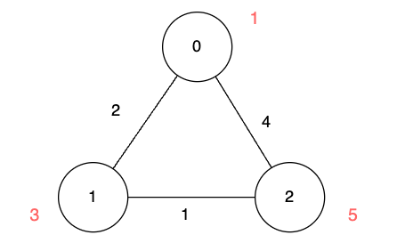
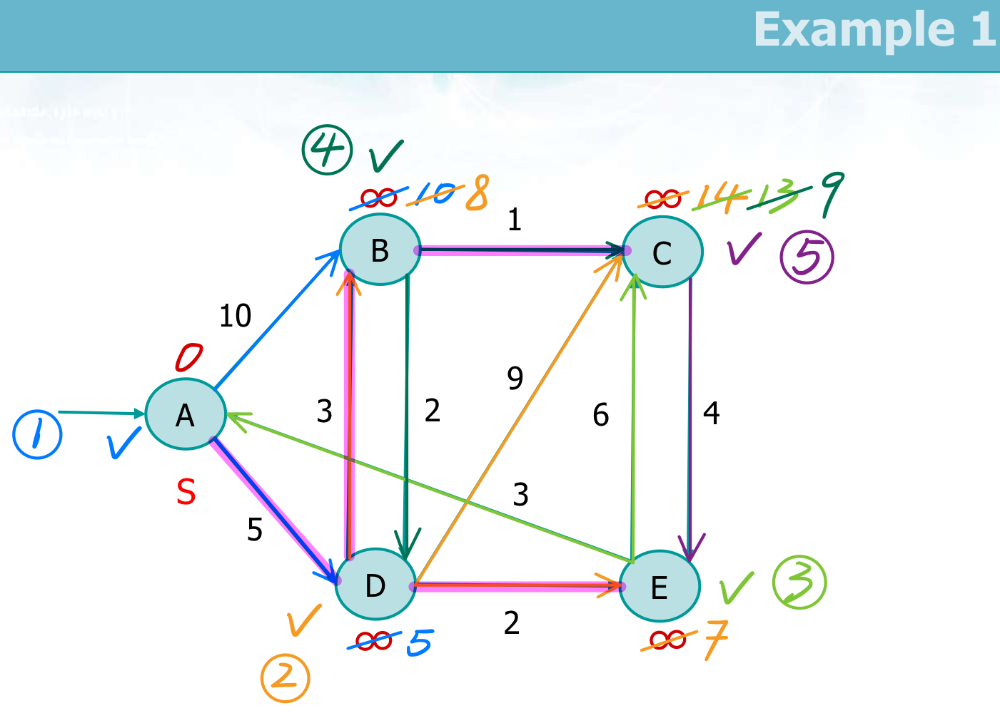
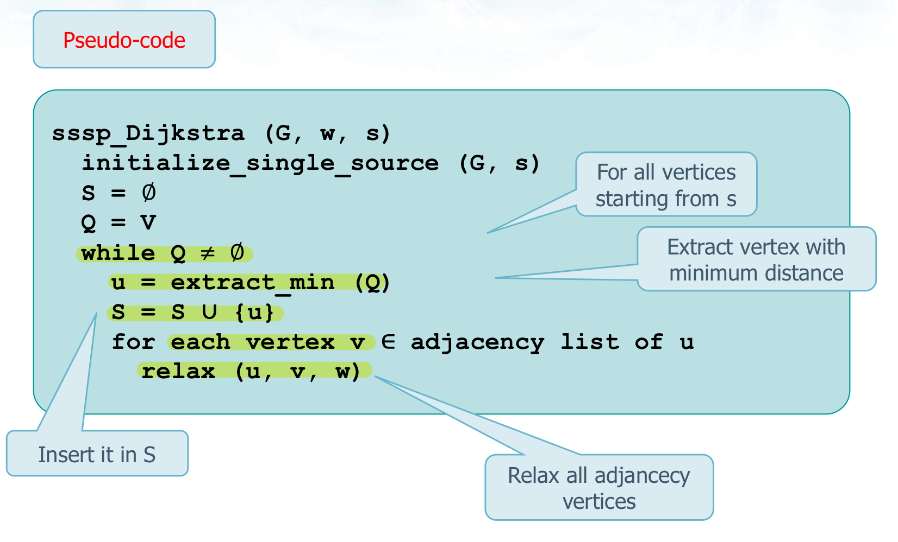

# 3112. Minimum Time to Visit Disappearing Nodes

给你一个二维数组 `edges` 表示一个 `n` 个点的无向图，其中 `edges[i] = [ui, vi, lengthi]` 表示节点 `ui` 和节点 `vi` 之间有一条需要 `lengthi` 单位时间通过的无向边。

同时给你一个数组 `disappear` ，其中 `disappear[i]` 表示节点 `i` 从图中消失的时间点，在那一刻及以后，你无法再访问这个节点。

**注意**，图有可能一开始是不连通的，两个节点之间也可能有多条边。

请你返回数组 `answer` ，`answer[i]` 表示从节点 `0` 到节点 `i` 需要的 **最少** 单位时间。如果从节点 `0` 出发 **无法** 到达节点 `i` ，那么 `answer[i]` 为 `-1` 。

 

**示例 1：**


**输入：**n = 3, edges = [[0,1,2],[1,2,1],[0,2,4]], disappear = [1,1,5]

**输出：**[0,-1,4]

**解释：**

我们从节点 0 出发，目的是用最少的时间在其他节点消失之前到达它们。

-   对于节点 0 ，我们不需要任何时间，因为它就是我们的起点。
-   对于节点 1 ，我们需要至少 2 单位时间，通过 `edges[0]` 到达。但当我们到达的时候，它已经消失了，所以我们无法到达它。
-   对于节点 2 ，我们需要至少 4 单位时间，通过 `edges[2]` 到达。

**示例 2：**



**输入：**n = 3, edges = [[0,1,2],[1,2,1],[0,2,4]], disappear = [1,3,5]

**输出：**[0,2,3]

**解释：**

我们从节点 0 出发，目的是用最少的时间在其他节点消失之前到达它们。

-   对于节点 0 ，我们不需要任何时间，因为它就是我们的起点。
-   对于节点 1 ，我们需要至少 2 单位时间，通过 `edges[0]` 到达。
-   对于节点 2 ，我们需要至少 3 单位时间，通过 `edges[0]` 和 `edges[1]` 到达。

**示例 3：**

**输入：**n = 2, edges = [[0,1,1]], disappear = [1,1]

**输出：**[0,-1]

**解释：**

当我们到达节点 1 的时候，它恰好消失，所以我们无法到达节点 1 。

 

**提示：**

-   `1 <= n <= 5 * 104`
-   `0 <= edges.length <= 105`
-   `edges[i] == [ui, vi, lengthi]`
-   `0 <= ui, vi <= n - 1`
-   `1 <= lengthi <= 105`
-   `disappear.length == n`
-   `1 <= disappear[i] <= 105`


**Single Source Shortest Paths**





```java
class Solution {
  public int[] minimumTime(int n, int[][] edges, int[] disappear) {
    List<int[]>[] adj = new List[n];
    for (int i = 0; i < n; i++) {
      adj[i] = new ArrayList<int[]>();
    }

    // load data
    for (int[] edge : edges) {
      int u = edge[0], v = edge[1], length = edge[2];
      adj[u].add(new int[]{v, length});
      adj[v].add(new int[]{u, length});
    }

    int[] ans = new int[n];
    Arrays.fill(ans, -1);
    ans[0] = 0;

    // 用 PriorityQueue 可以直接代替 extract_min 方法
    PriorityQueue<int[]> pq = new PriorityQueue<>((a, b) -> a[1] - b[1]);
    // 先把原点 (节点 0) 放进去
    pq.offer(new int[]{0, 0});
    while (!pq.isEmpty()) {
      int[] pair = pq.poll();
      int u = pair[0], t = pair[1];

      // 重要!!! 否则会超时!!
      // ans[u] 中的值经过多次更新后, 是距离最小的那个
      // t != anw[u] 表示当前 t 不是最小距离, 可以不用算
      if (t != ans[u]) continue;

      for (int[] next : adj[u]) {
        int v = next[0], length = next[1];
        // 判断能否在节点消失前到达这个节点以及当前算下来的路径长度是不是比之前记录的小
        if (t + length < disappear[v] && (ans[v] == -1 || t + length < ans[v])) {
          pq.offer(new int[]{v, t + length});
          ans[v] = t + length;
        }
      }
    }

    return ans;
  }
}
```

