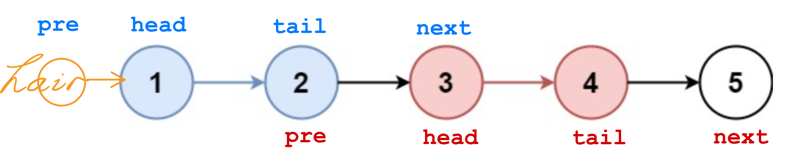

# 25. Reverse Nodes in k-Group

给你链表的头节点 `head` ，每 `k` 个节点一组进行翻转，请你返回修改后的链表。

`k` 是一个正整数，它的值小于或等于链表的长度。如果节点总数不是 `k` 的整数倍，那么请将最后剩余的节点保持原有顺序。

你不能只是单纯的改变节点内部的值，而是需要实际进行节点交换。

 

**示例 1：**


```
输入：head = [1,2,3,4,5], k = 2
输出：[2,1,4,3,5]
```

**示例 2：**


```
输入：head = [1,2,3,4,5], k = 3
输出：[3,2,1,4,5]
```

 

**提示：**

-   链表中的节点数目为 `n`
-   `1 <= k <= n <= 5000`
-   `0 <= Node.val <= 1000`

 

**进阶：**你可以设计一个只用 `O(1)` 额外内存空间的算法解决此问题吗？


```java
/**
 * Definition for singly-linked list.
 * public class ListNode {
 *     int val;
 *     ListNode next;
 *     ListNode() {}
 *     ListNode(int val) { this.val = val; }
 *     ListNode(int val, ListNode next) { this.val = val; this.next = next; }
 * }
 */

class Solution {
  public ListNode reverseKGroup(ListNode head, int k) {
    ListNode prehead = new ListNode(-1, head);
    ListNode pre = prehead;

    while (head != null) {
      ListNode tail = pre;

      // 查看剩余部分长度是否大于等于 k
      for (int i = 0; i < k; i++) {
        tail = tail.next;
        if (tail == null) {
          return prehead.next;
        }
      }
      
      // pre 和 next 是为了 reverse 一部分的 ListNode 可以接回去
      // pre 是 reverseList 的前一个 node，next 是后一个 node
      ListNode next = tail.next;
      
      ListNode[] reverse = reverseList(head, tail);
      head = reverse[0];
      tail = reverse[1];
      // 把一部分 reverse 后的 ListNode 接回去
      pre.next = head;
      tail.next = next;
      
      // 更新 pre 和 head
      pre = tail;
      head = tail.next;
    }
    
    return prehead.next;
  }
  
  public ListNode[] reverseList(ListNode head, ListNode tail) {
    ListNode tailNext = tail.next;
    ListNode newHead = new ListNode();
    ListNode newTail = head;
    // 这里不能直接用 tail.next 去替换 tailNext!!! 
    // 确保在反转链表的过程中, 循环的终止条件不会受到链表结构变化的影响 (在反转链表的过程中, tail.next 的值可能会被修改)
    // 直接使用 tail.next 可能会导致循环条件判断不准确，从而引发错误
    while (head != tailNext) {
      ListNode tmp = head;
      head = head.next;
      
      tmp.next = newHead;
      newHead = tmp;
    }
    
    return new ListNode[]{newHead, newTail};
  }
}

```

k
