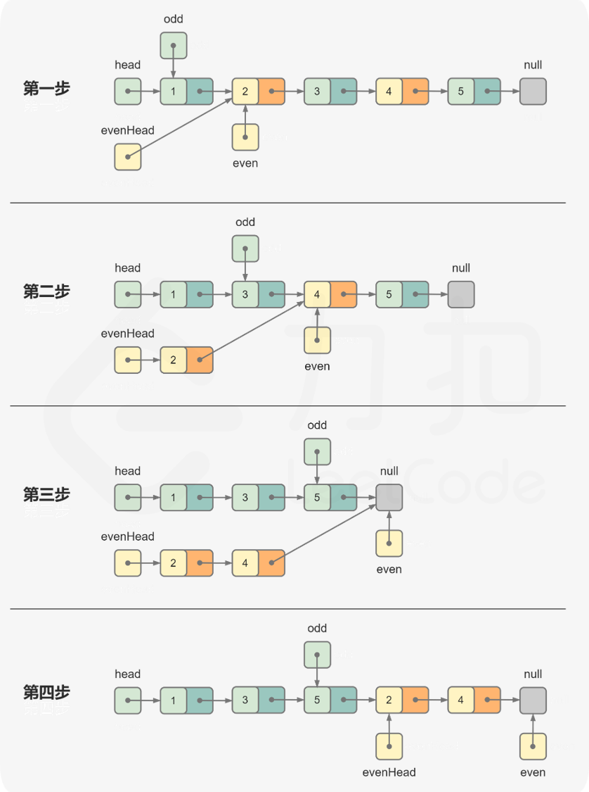

# 328. Odd Even Linked List

给定单链表的头节点 `head` ，将所有索引为奇数的节点和索引为偶数的节点分别组合在一起，然后返回重新排序的列表。

**第一个**节点的索引被认为是 **奇数** ， **第二个**节点的索引为 **偶数** ，以此类推。

请注意，偶数组和奇数组内部的相对顺序应该与输入时保持一致。

你必须在 `O(1)` 的额外空间复杂度和 `O(n)` 的时间复杂度下解决这个问题。

 

**示例 1:**


```
输入: head = [1,2,3,4,5]
输出: [1,3,5,2,4]
```

**示例 2:**


```
输入: head = [2,1,3,5,6,4,7]
输出: [2,3,6,7,1,5,4]
```

 

**提示:**

-   `n == ` 链表中的节点数
-   `0 <= n <= 104`
-   `-106 <= Node.val <= 106`





```java
/**
 * Definition for singly-linked list.
 * public class ListNode {
 *     int val;
 *     ListNode next;
 *     ListNode() {}
 *     ListNode(int val) { this.val = val; }
 *     ListNode(int val, ListNode next) { this.val = val; this.next = next; }
 * }
 */

class Solution {
  public ListNode oddEvenList(ListNode head) {
    if (head == null || head.next == null) return head;

    // oddHead 其实就是 head
    ListNode evenHead = head.next;
    // odd 是每次迭代指向奇数节点的指针, even 是每次迭代指向偶数节点的指针
    ListNode odd = head, even = head.next;

    // 每一次迭代, odd 和 even 成对移动
    while (even != null && even.next != null) {
      // odd.next 指向下一个奇数节点, 并将 odd 更新指向 odd.next (下一个奇数节点)
      odd.next = even.next;
      odd = odd.next;
      
      // even.next 指向下一个偶数节点, 并将 even 更新指向 even.next (下一个偶数节点)
      even.next = odd.next;
      even = even.next;
    }

    // 将偶数链表连接在奇数链表之后
    odd.next = evenHead;
    return head;
  }
}
```

