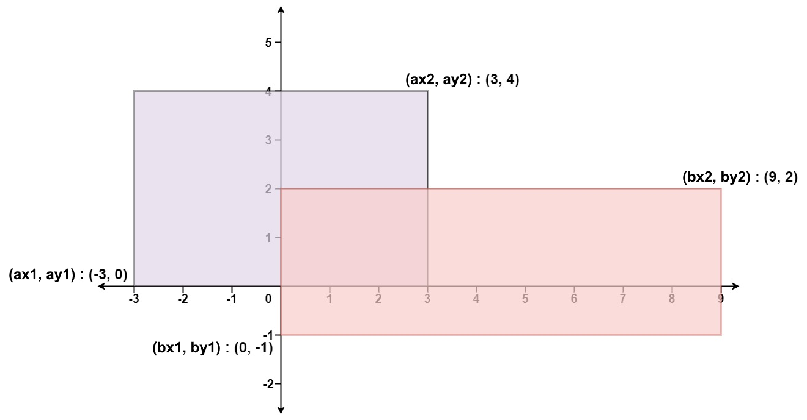

# 223. Rectangle Area

给你 **二维** 平面上两个 **由直线构成且边与坐标轴平行/垂直** 的矩形，请你计算并返回两个矩形覆盖的总面积。

每个矩形由其 **左下** 顶点和 **右上** 顶点坐标表示：

-   第一个矩形由其左下顶点 `(ax1, ay1)` 和右上顶点 `(ax2, ay2)` 定义。
-   第二个矩形由其左下顶点 `(bx1, by1)` 和右上顶点 `(bx2, by2)` 定义。

 

**示例 1：**



```
输入：ax1 = -3, ay1 = 0, ax2 = 3, ay2 = 4, bx1 = 0, by1 = -1, bx2 = 9, by2 = 2
输出：45
```

**示例 2：**

```
输入：ax1 = -2, ay1 = -2, ax2 = 2, ay2 = 2, bx1 = -2, by1 = -2, bx2 = 2, by2 = 2
输出：16
```

 

**提示：**

-   `-104 <= ax1, ay1, ax2, ay2, bx1, by1, bx2, by2 <= 104`


```java
class Solution {
  public int computeArea(int ax1, int ay1, int ax2, int ay2, int bx1, int by1, int bx2, int by2) {
    // 我们可以先求出两个矩形的面积然后减去重叠那部分的面积
    int area = 0;
    area += (ax2 - ax1) * (ay2 - ay1);
    area += (bx2 - bx1) * (by2 - by1);

    // 重叠矩形的左 x 坐标为 Math.max(ax1, bx1), 右 x 坐标为 Math.min(ax2, bx2)
    // 则重叠矩形的宽为右 x 坐标减去左 x 坐标
    // 同理重叠矩形的高也可以这么求出
    int overlapWidth = Math.min(ax2, bx2) - Math.max(ax1, bx1);
    int overlapHeight = Math.min(ay2, by2) - Math.max(ay1, by1);
    // 只有当两条线段的长度都大于 0 时, 重叠部分的面积才大于 0, 否则重叠部分的面积为 0
    int overlapArea = Math.max(overlapWidth, 0) * Math.max(overlapHeight, 0);

    return area - overlapArea;
  }
}
```

