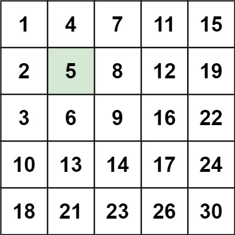

# 240. Search a 2D Matrix II

编写一个高效的算法来搜索 `*m* x *n*` 矩阵 `matrix` 中的一个目标值 `target` 。该矩阵具有以下特性：

-   每行的元素从左到右升序排列。
-   每列的元素从上到下升序排列。

 

**示例 1：**



```
输入：matrix = [[1,4,7,11,15],[2,5,8,12,19],[3,6,9,16,22],[10,13,14,17,24],[18,21,23,26,30]], target = 5
输出：true
```

**示例 2：**


```
输入：matrix = [[1,4,7,11,15],[2,5,8,12,19],[3,6,9,16,22],[10,13,14,17,24],[18,21,23,26,30]], target = 20
输出：false
```

 

**提示：**

-   `m == matrix.length`
-   `n == matrix[i].length`
-   `1 <= n, m <= 300`
-   `-109 <= matrix[i][j] <= 109`
-   每行的所有元素从左到右升序排列
-   每列的所有元素从上到下升序排列
-   `-109 <= target <= 109`


**Z 字形查找**: 首先我们可以想到直接暴力遍历, 接着可以用二分查找进行优化, 但是这还是远远不够的; 以下为时间复杂度为 O(m + n) 的算法

```java
class Solution {
  public boolean searchMatrix(int[][] matrix, int target) {
    int m = matrix.length, n = matrix[0].length;
    // 我们可以从矩阵 matrix 的右上角 (0,n−1) 进行搜索
    // 在每一步的搜索过程中, 如果我们位于位置 (x,y), 那么我们希望在以 matrix 的左下角为左下角, 以 (x,y) 为右上角的矩阵中进行搜索, 即行的范围为 [x,m−1], 列的范围为 [0,y]
    int x = 0, y = n - 1; 
    while (x < m && y >= 0) {
      if (matrix[x][y] == target) {
        // 搜索完成
        return true;
      }
      else if (matrix[x][y] > target) {
        // 由于每一列的元素都是升序排列的, 那么在当前的搜索矩阵中, 所有位于第 y 列的元素都是严格大于 target 的, 因此我们可以将它们全部忽略, 即将 y 减少 1
        y--;
      }
      else {
        // 由于每一行的元素都是升序排列的, 那么在当前的搜索矩阵中, 所有位于第 x 行的元素都是严格小于 target 的, 因此我们可以将它们全部忽略, 即将 x 增加 1
        x++;
      }
    }

    return false;
  }
}
```

