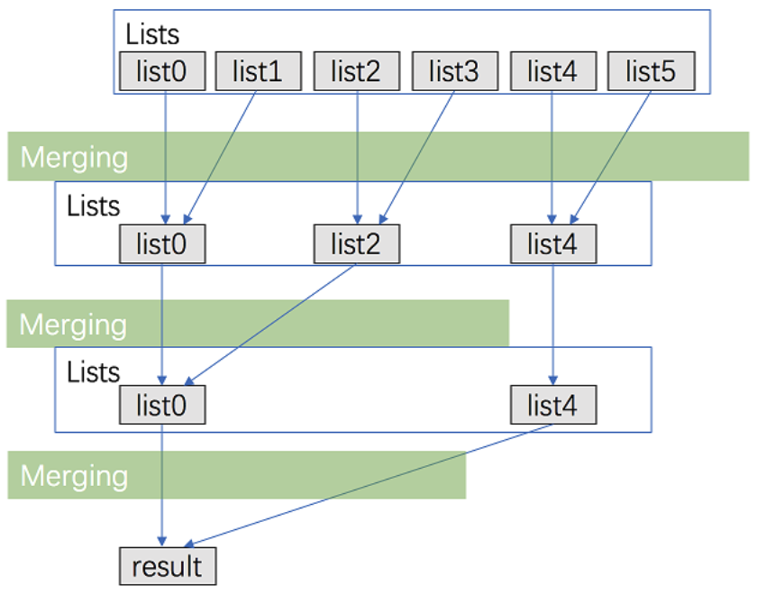

# 23. Merge k Sorted Lists

给你一个链表数组，每个链表都已经按升序排列。

请你将所有链表合并到一个升序链表中，返回合并后的链表。

 

**示例 1：**

```
输入：lists = [[1,4,5],[1,3,4],[2,6]]
输出：[1,1,2,3,4,4,5,6]
解释：链表数组如下：
[
  1->4->5,
  1->3->4,
  2->6
]
将它们合并到一个有序链表中得到。
1->1->2->3->4->4->5->6
```

**示例 2：**

```
输入：lists = []
输出：[]
```

**示例 3：**

```
输入：lists = [[]]
输出：[]
```

 

**提示：**

- `k == lists.length`
- `0 <= k <= 10^4`
- `0 <= lists[i].length <= 500`
- `-10^4 <= lists[i][j] <= 10^4`
- `lists[i]` 按 **升序** 排列
- `lists[i].length` 的总和不超过 `10^4`


  


```java
/**
 * Definition for singly-linked list.
 * public class ListNode {
 *     int val;
 *     ListNode next;
 *     ListNode() {}
 *     ListNode(int val) { this.val = val; }
 *     ListNode(int val, ListNode next) { this.val = val; this.next = next; }
 * }
 */

class Solution {
  public ListNode mergeKLists(ListNode[] lists) {
    return merge_r(lists, 0, lists.length - 1);
  }

  // this method is what we showed the picture
  // similar as the MergeSort
  public ListNode merge_r(ListNode[] lists, int l, int r) {
    if (l > r) {
      return null;
    }

    if (l == r) return lists[l];

    int mid = (l + r) / 2;

    return mergeTwoLists(merge_r(lists, l, mid), merge_r(lists, mid+1, r));
  }
  
  public ListNode mergeTwoLists(ListNode a, ListNode b) {
    ListNode head = new ListNode(0);
    ListNode tail = head;

    while (a != null && b != null) {
      if (a.val <= b.val) {
        tail.next = a;
        a = a.next;
        tail = tail.next;
      } else {
        tail.next = b;
        b = b.next;
        tail = tail.next;
      }
    }

    if (a != null) {
      tail.next = a;
    }
    if (b != null) {
      tail.next = b;
    }

    return head.next;
  }
}
```

