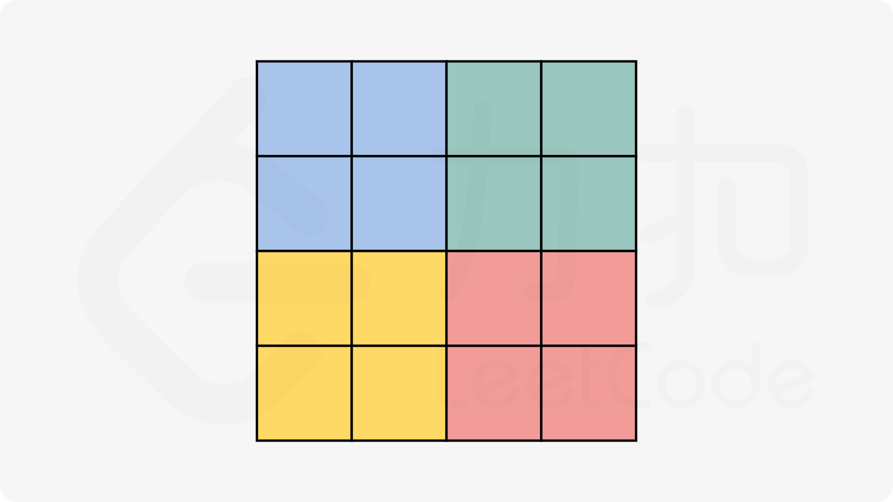
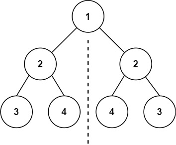

# Hash

## 1. 两数之和

给定一个整数数组 `nums` 和一个整数目标值 `target`，请你在该数组中找出 **和为目标值** `target` 的那 **两个** 整数，并返回它们的数组下标。

你可以假设每种输入只会对应一个答案，并且你不能使用两次相同的元素。

你可以按任意顺序返回答案。

 

**示例 1：**

```
输入：nums = [2,7,11,15], target = 9
输出：[0,1]
解释：因为 nums[0] + nums[1] == 9 ，返回 [0, 1] 。
```

**示例 2：**

```
输入：nums = [3,2,4], target = 6
输出：[1,2]
```

**示例 3：**

```
输入：nums = [3,3], target = 6
输出：[0,1]
```

 

**提示：**

- `2 <= nums.length <= 104`
- `-109 <= nums[i] <= 109`
- `-109 <= target <= 109`
- **只会存在一个有效答案**

 

**进阶：**你可以想出一个时间复杂度小于 `O(n2)` 的算法吗？


----

```java
class Solution {
    public int[] twoSum(int[] nums, int target) {
        Map<Integer, Integer> map = new HashMap<>();
        for (int i = 0; i < nums.length; i++) {
            // 对于每一个 x, 我们首先查询哈希表中是否存在 target-x, 然后将 x 插入到哈希表中, 即可保证不会让 x 和自己匹配
            if (map.containsKey(target - nums[i])) {
                // 注意 map.get(target - nums[i]) 应该放在前面, 按照从前往后遍历的顺序
                return new int[]{map.get(target - nums[i]), i};
            }

            map.put(nums[i], i);
        }

        return null;
    }
}
```


## 49. 字母异位词分组

给你一个字符串数组，请你将 **字母异位词** 组合在一起。可以按任意顺序返回结果列表。

**字母异位词** 是由重新排列源单词的所有字母得到的一个新单词。

 

**示例 1:**

```
输入: strs = ["eat", "tea", "tan", "ate", "nat", "bat"]
输出: [["bat"],["nat","tan"],["ate","eat","tea"]]
```

**示例 2:**

```
输入: strs = [""]
输出: [[""]]
```

**示例 3:**

```
输入: strs = ["a"]
输出: [["a"]]
```

 

**提示：**

- `1 <= strs.length <= 104`
- `0 <= strs[i].length <= 100`
- `strs[i]` 仅包含小写字母


---

**方法一: 排序**

```java
class Solution {
    public List<List<String>> groupAnagrams(String[] strs) {
        Map<String, List<String>> map = new HashMap<>();
        for (String str : strs) {
            // 由于互为字母异位词的两个字符串包含的字母相同
            // 因此对两个字符串分别进行排序之后得到的字符串一定是相同的
            // 故可以将排序之后的字符串作为哈希表的键
            char[] array = str.toCharArray();
            Arrays.sort(array);
            String key = new String(array);

            List<String> list = map.get(key);
            if (list == null) list = new ArrayList<String>();
            list.add(str);
            map.put(key, list);
        }

        return new ArrayList<List<String>>(map.values());
    }
}
```


**方法二：计数**

```java
class Solution {
    public List<List<String>> groupAnagrams(String[] strs) {
        Map<String, List<String>> map = new HashMap<>();
        for (String str : strs) {
            // 由于互为字母异位词的两个字符串包含的字母相同
            // 因此两个字符串中的相同字母出现的次数一定是相同的
            // 故可以将每个字母出现的次数使用字符串表示, 作为哈希表的键
            int[] counts = new int[26];
            for (int i = 0; i < str.length(); i++) {
                counts[str.charAt(i) - 'a']++;
            }

            // 将每个出现次数大于 0 的字母和出现次数按顺序拼接成字符串, 作为哈希表的键
            StringBuffer sb = new StringBuffer();
            for (int i = 0; i < 26; i++) {
                if (counts[i] != 0) {
                    sb.append((char)('a' + i));
                    sb.append(counts[i]);
                }
            }

            String key = sb.toString();
            List<String> list = map.get(key);
            if (list == null) list = new ArrayList<>();
            list.add(str);
            map.put(key, list);
        }

        return new ArrayList<List<String>>(map.values());
    }
}
```


## 128. 最长连续序列

给定一个未排序的整数数组 `nums` ，找出数字连续的最长序列（不要求序列元素在原数组中连续）的长度。

请你设计并实现时间复杂度为 `O(n)` 的算法解决此问题。

 

**示例 1：**

```
输入：nums = [100,4,200,1,3,2]
输出：4
解释：最长数字连续序列是 [1, 2, 3, 4]。它的长度为 4。
```

**示例 2：**

```
输入：nums = [0,3,7,2,5,8,4,6,0,1]
输出：9
```

**示例 3：**

```
输入：nums = [1,0,1,2]
输出：3
```

 

**提示：**

- `0 <= nums.length <= 105`
- `-109 <= nums[i] <= 109`


---

```java
class Solution {
    public int longestConsecutive(int[] nums) {
        Set<Integer> set = new HashSet<>();
        for (int num : nums) {
            set.add(num);
        }

        int longest = 0;
        // 直接遍历去重后的 set, 而不是 nums, 否则当若数组有大量重复元素时会花费更多时间, 会超时!!
        for (int num : set) {
            // 判断是否跳过(剪枝操作), 由于我们要枚举的数 num 一定是在数组中不存在前驱数 num−1 的, 不然我们就会从 num−1 开始尝试匹配, 因此我们每次在哈希表中检查是否存在 num−1 即能判断是否需要跳过
            if (!set.contains(num - 1)) {
                // 去寻找 set 中包含 num 连续的后面的数的个数
                int i = 1;
                while (set.contains(num + i)) {
                    i++;
                }

                longest = Math.max(longest, i);
            }
        }

        return longest;
    }
}
```


# Double Pointers

## 283. 移动零

给定一个数组 `nums`，编写一个函数将所有 `0` 移动到数组的末尾，同时保持非零元素的相对顺序。

**请注意** ，必须在不复制数组的情况下原地对数组进行操作。

 

**示例 1:**

```
输入: nums = [0,1,0,3,12]
输出: [1,3,12,0,0]
```

**示例 2:**

```
输入: nums = [0]
输出: [0]
```

 

**提示**:

- `1 <= nums.length <= 104`
- `-231 <= nums[i] <= 231 - 1`


----

```java
class Solution {
    public void moveZeroes(int[] nums) {
        // 使用双指针, 左指针指向当前已经处理好的序列的尾部, 右指针指向待处理序列的头部
        int n = nums.length, left = 0, right = 0;
        // 右指针不断向右移动, 每次右指针指向非零数, 则将左右指针对应的数交换, 同时左指针右移
        // 左指针左边均为非零数; 右指针左边直到左指针处均为零。
        while (right < n) {
            if (nums[right] != 0) {
                swap(nums, left, right);
                left++;
            }
            right++;
        }
    }

    public void swap(int[] nums, int left, int right) {
        int temp = nums[left];
        nums[left] = nums[right];
        nums[right] = temp;
    }
}
```

```java
class Solution {
    public void moveZeroes(int[] nums) {
        // 直接用指针保存相对位置, 然后覆盖值, 最后补0, 不需要交换
        int n = nums.length, i = 0, j = 0;
        while (j < n) {
            if (nums[j] != 0) {
                nums[i] = nums[j];
                i++;
            }
            
            j++;
        }

        for (int k = i; k < nums.length; k++) {
            nums[k] = 0;
        }
    }
}
```


## 11. 盛最多水的容器

给定一个长度为 `n` 的整数数组 `height` 。有 `n` 条垂线，第 `i` 条线的两个端点是 `(i, 0)` 和 `(i, height[i])` 。

找出其中的两条线，使得它们与 `x` 轴共同构成的容器可以容纳最多的水。

返回容器可以储存的最大水量。

**说明：**你不能倾斜容器。

 

**示例 1：**


```
输入：[1,8,6,2,5,4,8,3,7]
输出：49 
解释：图中垂直线代表输入数组 [1,8,6,2,5,4,8,3,7]。在此情况下，容器能够容纳水（表示为蓝色部分）的最大值为 49。
```

**示例 2：**

```
输入：height = [1,1]
输出：1
```

 

**提示：**

- `n == height.length`
- `2 <= n <= 105`
- `0 <= height[i] <= 104`


---

```java
class Solution {
    public int maxArea(int[] height) {
        // 在初始时, 左右指针分别指向数组的左右两端
        int l = 0, r = height.length - 1;
        int res = 0;
        while (l < r) {
            int area = (r - l) * Math.min(height[l], height[r]);
            res = Math.max(res, area);

            // 此时我们需要移动一个指针, 移动哪一个呢? 
            // 直觉告诉我们, 应该移动对应数字较小的那个指针; 这是因为, 由于容纳的水量是由「两个指针指向的数字中较小值 ∗ 指针之间的距离」决定的
            // 如果我们移动数字较大的那个指针, 那么前者「两个指针指向的数字中较小值」不会增加, 后者「指针之间的距离」会减小, 那么这个乘积会减小; 因此我们移动数字较大的那个指针是不合理的; 因此我们移动数字较小的那个指针
            if (height[l] <= height[r]) {
                l++;
            } else {
                r--;
            }
        }

        return res;
    }
}
```


## 15. 三数之和

给你一个整数数组 `nums` ，判断是否存在三元组 `[nums[i], nums[j], nums[k]]` 满足 `i != j`、`i != k` 且 `j != k` ，同时还满足 `nums[i] + nums[j] + nums[k] == 0` 。请你返回所有和为 `0` 且不重复的三元组。

**注意：**答案中不可以包含重复的三元组。

  

**示例 1：**

```
输入：nums = [-1,0,1,2,-1,-4]
输出：[[-1,-1,2],[-1,0,1]]
解释：
nums[0] + nums[1] + nums[2] = (-1) + 0 + 1 = 0 。
nums[1] + nums[2] + nums[4] = 0 + 1 + (-1) = 0 。
nums[0] + nums[3] + nums[4] = (-1) + 2 + (-1) = 0 。
不同的三元组是 [-1,0,1] 和 [-1,-1,2] 。
注意，输出的顺序和三元组的顺序并不重要。
```

**示例 2：**

```
输入：nums = [0,1,1]
输出：[]
解释：唯一可能的三元组和不为 0 。
```

**示例 3：**

```
输入：nums = [0,0,0]
输出：[[0,0,0]]
解释：唯一可能的三元组和为 0 。
```

 

**提示：**

- `3 <= nums.length <= 3000`
- `-105 <= nums[i] <= 105`


---

```java
class Solution {
  public List<List<Integer>> threeSum(int[] nums) {
    List<List<Integer>> res = new ArrayList<>();
    int n = nums.length;
    Arrays.sort(nums);

    // 枚举 a
    for (int first = 0; first < n - 2; first++) {
      // a 需要和上一次枚举的数不相同
      if (first > 0 && nums[first] == nums[first - 1]) {
        continue;
      }

      // c 对应的指针初始指向数组的最右端
      int third = n - 1;
      int target = -nums[first];
      
      // 枚举 b
      for (int second = first + 1; second < n - 1; second++) {
        // b 需要和上一次枚举的数不相同
        if (second > first + 1 && nums[second] == nums[second - 1]) continue;

        // 需要保证 b 的指针在 c 的指针的左侧以及调整 c 指针使得 b + c 接近 target
        while (second < third && nums[second] + nums[third] > target) {
          third--;
        }

        // 如果 b c 指针重合就退出循环
        if (second == third) break;
        
        if (nums[second] + nums[third] == target) {
          List<Integer> ans = new ArrayList<>();
          ans.add(nums[first]);
          ans.add(nums[second]);
          ans.add(nums[third]);
          res.add(ans);
        }
      }
    }

    return res;
  }
}
```


以下是对上一个代码进行的优化剪枝操作

```java
class Solution {
  public List<List<Integer>> threeSum(int[] nums) {
    List<List<Integer>> res = new ArrayList<>();
    int n = nums.length;
    Arrays.sort(nums);

    for (int first = 0; first < n - 2; first++) {
      if (first > 0 && nums[first] == nums[first - 1]) {
        continue;
      }

      // 在确定第一个数后, 如果 nums[first] + nums[first + 1] + nums[first + 2] > 0, 说明此时剩下的两个数无论取什么值, 三数之和一定大于 0, 因此退出第一重循环
      if (nums[first] + nums[first + 1] + nums[first + 2] > 0) {
        break;
      }

      // 在确定第一个数之后, 如果 nums[first] + nums[n - 2] + nums[n - 1] < 0, 说明此时剩下的三个数无论取什么值, 三数之和一定小于 0, 因此第一重循环直接进入下一轮
      if (nums[first] + nums[n - 2] + nums[n - 1] < 0) {
        continue;
      }

      int second = first + 1, third = n - 1;
      while (second < third) {
        int sum = nums[first] + nums[second] + nums[third];
        if (sum == 0) {
          // 找到答案并添加进 res
          res.add(Arrays.asList(nums[first], nums[second], nums[third]));

          // b 需要和上一次枚举的数不相同
          while (second < third && nums[second] == nums[second + 1]) {
            second++;
          }
          second++;

          // c 需要和上一次枚举的数不相同
          while (second < third && nums[third] == nums[third - 1]) {
            third--;
          }
          third--;
        }
        else if (sum < 0) {
          // 此时说明 second 指针得向右移才能使得 sum 接近于 0
          second++;
        }
        else {
          // 此时说明 third 指针得向左移才能使得 sum 接近于 0
          third--;
        }
      }
    }

    return res;
  }
}
```


## 42. 接雨水

给定 `n` 个非负整数表示每个宽度为 `1` 的柱子的高度图，计算按此排列的柱子，下雨之后能接多少雨水。

 

**示例 1：**


```
输入：height = [0,1,0,2,1,0,1,3,2,1,2,1]
输出：6
解释：上面是由数组 [0,1,0,2,1,0,1,3,2,1,2,1] 表示的高度图，在这种情况下，可以接 6 个单位的雨水（蓝色部分表示雨水）。 
```

**示例 2：**

```
输入：height = [4,2,0,3,2,5]
输出：9
```

 

**提示：**

- `n == height.length`
- `1 <= n <= 2 * 104`
- `0 <= height[i] <= 105`


# Slide Windows

## 3. 无重复字符的最长子串

给定一个字符串 `s` ，请你找出其中不含有重复字符的 **最长 子串** 的长度。

 

**示例 1:**

```
输入: s = "abcabcbb"
输出: 3 
解释: 因为无重复字符的最长子串是 "abc"，所以其长度为 3。
```

**示例 2:**

```
输入: s = "bbbbb"
输出: 1
解释: 因为无重复字符的最长子串是 "b"，所以其长度为 1。
```

**示例 3:**

```
输入: s = "pwwkew"
输出: 3
解释: 因为无重复字符的最长子串是 "wke"，所以其长度为 3。
     请注意，你的答案必须是 子串 的长度，"pwke" 是一个子序列，不是子串。
```

 

**提示：**

- `0 <= s.length <= 5 * 104`
- `s` 由英文字母、数字、符号和空格组成


---

```java
class Solution {
    public int lengthOfLongestSubstring(String s) {
        Set<Character> set = new HashSet<>();
        int res = 0;
        for (int left = 0, right = 0; right < s.length(); right++) { // 每一轮右端点都扩一个
            char ch = s.charAt(right); // right 指向的元素, 也是当前要考虑的元素
            
            // set 中有 ch, 则缩短左边界, 同时从 set 集合移除 ch
            // e.g., abcdc, 当 ch 是第二个 c 时, 需从 set 中移除 abc, left 指向 d, 将 dc 作为当前没有重复元素的子串
            while (set.contains(ch)) {
                set.remove(s.charAt(left));
                left++;
            }

            set.add(ch); // 别忘记将当前元素加入
            res = Math.max(res, right - left + 1);
        }
        
        return res;
    }
}
```


## 438. 找到字符串中所有字母异位词

给定两个字符串 `s` 和 `p`，找到 `s` 中所有 `p` 的 **异位词** 的子串，返回这些子串的起始索引。不考虑答案输出的顺序。

 

**示例 1:**

```
输入: s = "cbaebabacd", p = "abc"
输出: [0,6]
解释:
起始索引等于 0 的子串是 "cba", 它是 "abc" 的异位词。
起始索引等于 6 的子串是 "bac", 它是 "abc" 的异位词。
```

 **示例 2:**

```
输入: s = "abab", p = "ab"
输出: [0,1,2]
解释:
起始索引等于 0 的子串是 "ab", 它是 "ab" 的异位词。
起始索引等于 1 的子串是 "ba", 它是 "ab" 的异位词。
起始索引等于 2 的子串是 "ab", 它是 "ab" 的异位词。
```

 

**提示:**

- `1 <= s.length, p.length <= 3 * 104`
- `s` 和 `p` 仅包含小写字母


---

```java
class Solution {
    public List<Integer> findAnagrams(String s, String p) {
        int sLen = s.length(), pLen = p.length();
        if (sLen < pLen) return new ArrayList<Integer>();

        List<Integer> list = new ArrayList<>();
        
        // 初始设置
        int[] sCount = new int[26];
        int[] pCount = new int[26];
        for (int i = 0; i < pLen; i++) {
            sCount[s.charAt(i) - 'a']++;
            pCount[p.charAt(i) - 'a']++;
        }

        // 首先判断以 0 为首的 s 子串是不是 p 的异位词
        if (Arrays.equals(sCount, pCount)) {
            list.add(0);
        }

        // 窗口以固定大小(pLen)进行滑动
        int left = 0, right = pLen;
        while (right < sLen) {
            // 减去滑动窗口的最左边第 0 位, 即窗口变为 1, 2
            sCount[s.charAt(left) - 'a']--;
            // 窗口滑动
            left++;

            // 加上窗口的最右边第 plen 位(第 3 位), 即窗口变为 1, 2, 3
            sCount[s.charAt(right) - 'a']++;
            // 窗口滑动
            right++;

            // 判断
            if (Arrays.equals(sCount, pCount)) {
                list.add(left);
            }
        }

        return list;
    }
}
```


以下是滑动窗口的优化版:

```java
class Solution {
    public List<Integer> findAnagrams(String s, String p) {
        int sLen = s.length(), pLen = p.length();
        if (sLen < pLen) return new ArrayList<Integer>();

        List<Integer> list = new ArrayList<>();
        int[] count = new int[26];
        for (int i = 0; i < pLen; i++) {
            count[s.charAt(i) - 'a']++;
            count[p.charAt(i) - 'a']--;
        }

        // 在方法一的基础上，我们不再分别统计滑动窗口和字符串 p 中每种字母的数量，而是统计滑动窗口和字符串 p 中每种字母数量的差；并引入变量 differ 来记录当前窗口与字符串 p 中数量不同的字母的个数，并在滑动窗口的过程中维护它
        // 在判断滑动窗口中每种字母的数量与字符串 p 中每种字母的数量是否相同时，只需要判断 differ 是否为零即可
        int differ = 0;
        for (int i = 0; i < 26; i++) {
            if (count[i] != 0) differ++;
        }

        if (differ == 0) {
            list.add(0);
        }

        int left = 0, right = pLen;
        while (right < sLen) {
            // 窗口中字母 s[left] 的数量与字符串 p 中的数量从不同变得相同
            if (count[s.charAt(left) - 'a'] == 1) differ--;
            // 窗口中字母 s[left] 的数量与字符串 p 中的数量从相同变得不同
            else if (count[s.charAt(left) - 'a'] == 0) differ++;
            count[s.charAt(left) - 'a']--;
            left++;

            // 窗口中字母 s[right] 的数量与字符串 p 中的数量从不同变得相同
            if (count[s.charAt(right) - 'a'] == -1) differ--;
            // 窗口中字母 s[right] 的数量与字符串 p 中的数量从相同变得不同
            else if (count[s.charAt(right) - 'a'] == 0) differ++;
            count[s.charAt(right) - 'a']++;
            right++;

            if (differ == 0) {
                list.add(left);
            }
        }

        return list;
    }
}
```


# Substrings

## 560. 和为 K 的子数组

给你一个整数数组 `nums` 和一个整数 `k` ，请你统计并返回 *该数组中和为 `k` 的子数组的个数* 。

子数组是数组中元素的连续非空序列。

 

**示例 1：**

```
输入：nums = [1,1,1], k = 2
输出：2
```

**示例 2：**

```
输入：nums = [1,2,3], k = 3
输出：2
```

 

**提示：**

- `1 <= nums.length <= 2 * 104`
- `-1000 <= nums[i] <= 1000`
- `-107 <= k <= 107`


---

**前缀和**:

```java
class Solution {
    public int subarraySum(int[] nums, int k) {
        int n = nums.length;
        // 计算到当前元素为止的前缀和 pre
        int pre = 0, res = 0;
        // 用哈希表记录每个前缀和(key)出现的次数(value)
        Map<Integer, Integer> map = new HashMap<>();
        // 哈希表初始化为(0, 1), 表示前缀和为 0 出现了 1 次, 以处理从数组起始到某位置的和正好为 k 的情况
        map.put(0, 1);

        for (int i = 0; i < n; i++) {
            // 更新前缀和 pre
            pre += nums[i];

            // 对于当前前缀和 pre, 检查是否存在 pre - k 的前缀和
            // 若存在, 则说明这两个前缀和之间的子数组和为 k
            if (map.containsKey(pre - k)) {
                res += map.get(pre - k);
            }

            // 更新当前前缀和的出现次数
            Integer count = map.get(pre);
            if (count == null) {
                map.put(pre, 1);
            } else {
                map.put(pre, count + 1);
            }
        }

        return res;
    }
}
```


## 239. 滑动窗口最大值

给你一个整数数组 `nums`，有一个大小为 `k` 的滑动窗口从数组的最左侧移动到数组的最右侧。你只可以看到在滑动窗口内的 `k` 个数字。滑动窗口每次只向右移动一位。

返回 *滑动窗口中的最大值* 。

 

**示例 1：**

```
输入：nums = [1,3,-1,-3,5,3,6,7], k = 3
输出：[3,3,5,5,6,7]
解释：
滑动窗口的位置                最大值
---------------               -----
[1  3  -1] -3  5  3  6  7       3
 1 [3  -1  -3] 5  3  6  7       3
 1  3 [-1  -3  5] 3  6  7       5
 1  3  -1 [-3  5  3] 6  7       5
 1  3  -1  -3 [5  3  6] 7       6
 1  3  -1  -3  5 [3  6  7]      7
```

**示例 2：**

```
输入：nums = [1], k = 1
输出：[1]
```

 

**提示：**

- `1 <= nums.length <= 105`
- `-104 <= nums[i] <= 104`
- `1 <= k <= nums.length`


---

```java
class Solution {
    public int[] maxSlidingWindow(int[] nums, int k) {
        int n = nums.length;
        if (n == 0) return new int[0];

        int[] res = new int[n - k + 1];
        // 该队列将存储当前滑动窗口中元素的索引, 确保队列中的元素值是单调递减的
        Deque<Integer> deq = new LinkedList<>();

        for (int i = 0; i < n; i++) {
            // 移除不在当前滑动窗口内的元素索引, 最后在队列顶端的元素索引对应的元素即是当前滑动窗口中最大的元素值
            while (!deq.isEmpty() && deq.peekFirst() < i - k + 1) {
                deq.pollFirst();
            }

            // 从后向前依次移除队列中所有小于当前元素的元素
            while (!deq.isEmpty() && nums[deq.peekLast()] < nums[i]) {
                deq.pollLast();
            }

            // 并将当前元素的索引添加到队尾
            deq.offerLast(i);

            // 如果遍历的索引大于等于 k-1，开始记录结果
            // 防止当 i = 0, k = 3, 直接把 i = 0 对应的元素写入 res
            if (i >= k - 1) {
                res[i - k + 1] = nums[deq.peekFirst()];
            }
        }

        return res;
    }
}
```


# Array

## 53. 最大子数组和

给你一个整数数组 `nums` ，请你找出一个具有最大和的连续子数组（子数组最少包含一个元素），返回其最大和。

**子数组** 是数组中的一个连续部分。

 

**示例 1：**

```
输入：nums = [-2,1,-3,4,-1,2,1,-5,4]
输出：6
解释：连续子数组 [4,-1,2,1] 的和最大，为 6 。
```

**示例 2：**

```
输入：nums = [1]
输出：1
```

**示例 3：**

```
输入：nums = [5,4,-1,7,8]
输出：23
```

 

**提示：**

- `1 <= nums.length <= 105`
- `-104 <= nums[i] <= 104`


---

**方法一: 动态规划**
$$
f(i)= \max\{f(i−1)+nums[i],nums[i]\}
\notag
$$

```java
class Solution {
    public int maxSubArray(int[] nums) {
        int pre = 0, res = nums[0];
        for (int x : nums) {
            pre = Math.max(pre + x, x);
            res = Math.max(res, pre);
        }
        return res;
    }
}
```


**方法二: 分治**


## 56. 合并区间

以数组 `intervals` 表示若干个区间的集合，其中单个区间为 `intervals[i] = [starti, endi]` 。请你合并所有重叠的区间，并返回 *一个不重叠的区间数组，该数组需恰好覆盖输入中的所有区间* 。

 

**示例 1：**

```
输入：intervals = [[1,3],[2,6],[8,10],[15,18]]
输出：[[1,6],[8,10],[15,18]]
解释：区间 [1,3] 和 [2,6] 重叠, 将它们合并为 [1,6].
```

**示例 2：**

```
输入：intervals = [[1,4],[4,5]]
输出：[[1,5]]
解释：区间 [1,4] 和 [4,5] 可被视为重叠区间。
```

 

**提示：**

- `1 <= intervals.length <= 104`
- `intervals[i].length == 2`
- `0 <= starti <= endi <= 104`


---

```java
class Solution {
    public int[][] merge(int[][] intervals) {
        if (intervals.length == 0) return new int[0][2];

        // 对每个 interval 的左区间进行排序
        Arrays.sort(intervals, new Comparator<int[]>() {
            public int compare(int[] a, int[] b) {
                return a[0] - b[0];
            }
        });

        List<int[]> list = new ArrayList<>();
        int preLeft = intervals[0][0], preRight = intervals[0][1];
        for (int i = 1; i < intervals.length; i++) {
            // 每次遍历都判断是否当前区间能和上一个区间合并
            int left = intervals[i][0], right = intervals[i][1];
            if (preRight >= left) { // 可以合并
                if (preRight < right) { // 为避免特殊情况 e.g., [2, 6], [3, 5] 
                    preRight = right;
                }
            } else { // 不可以合并, 故记录上一个区间
                list.add(new int[]{preLeft, preRight});
                preLeft = left; preRight = right;
            }
        }
        list.add(new int[]{preLeft, preRight});

        return list.toArray(new int[list.size()][]);
    }
}
```


## 189. 轮转数组

给定一个整数数组 `nums`，将数组中的元素向右轮转 `k` 个位置，其中 `k` 是非负数。

 

**示例 1:**

```
输入: nums = [1,2,3,4,5,6,7], k = 3
输出: [5,6,7,1,2,3,4]
解释:
向右轮转 1 步: [7,1,2,3,4,5,6]
向右轮转 2 步: [6,7,1,2,3,4,5]
向右轮转 3 步: [5,6,7,1,2,3,4]
```

**示例 2:**

```
输入：nums = [-1,-100,3,99], k = 2
输出：[3,99,-1,-100]
解释: 
向右轮转 1 步: [99,-1,-100,3]
向右轮转 2 步: [3,99,-1,-100]
```

 

**提示：**

- `1 <= nums.length <= 105`
- `-231 <= nums[i] <= 231 - 1`
- `0 <= k <= 105`

 

**进阶：**

- 尽可能想出更多的解决方案，至少有 **三种** 不同的方法可以解决这个问题。
- 你可以使用空间复杂度为 `O(1)` 的 **原地** 算法解决这个问题吗？


---

当我们将数组的元素向右移动 k 次后, 尾部 k % n 个元素会移动至数组头部, 其余元素向后移动 k % n

该方法为数组的翻转: 我们可以先将所有元素翻转, 这样尾部的 k % n 至数组头部, 然后我们再翻转 [0, k % n−1] 区间的元素和 [k % n, n−1] 区间的元素即能得到最后的答案

我们以 n = 7, k = 3 为例进行如下展示:

| 操作                         | 结果          |
| ---------------------------- | ------------- |
| 原始数组                     | 1 2 3 4 5 6 7 |
| 翻转所有元素                 | 7 6 5 4 3 2 1 |
| 翻转 [0, k % n−1] 区间的元素 | 5 6 7 4 3 2 1 |
| 翻转 [k % n, n−1] 区间的元素 | 5 6 7 1 2 3 4 |

```java
class Solution {
    public void rotate(int[] nums, int k) {
        int n = nums.length;
        k = k % n;
        
        reverse(nums, 0, n - 1);
        reverse(nums, 0, k - 1);
        reverse(nums, k, n - 1);
    }

    public void reverse(int[] nums, int start, int end) {
        while (start < end) {
            int tmp = nums[start];
            nums[start] = nums[end];
            nums[end] = tmp;
            
            start++; end--;
        }
    }
}
```


## 238. 除自身以外数组的乘积

给你一个整数数组 `nums`，返回 数组 `answer` ，其中 `answer[i]` 等于 `nums` 中除 `nums[i]` 之外其余各元素的乘积 。

题目数据 **保证** 数组 `nums`之中任意元素的全部前缀元素和后缀的乘积都在 **32 位** 整数范围内。

请 **不要使用除法，**且在 `O(n)` 时间复杂度内完成此题。

 

**示例 1:**

```
输入: nums = [1,2,3,4]
输出: [24,12,8,6]
```

**示例 2:**

```
输入: nums = [-1,1,0,-3,3]
输出: [0,0,9,0,0]
```

 

**提示：**

- `2 <= nums.length <= 105`
- `-30 <= nums[i] <= 30`
- 输入 **保证** 数组 `answer[i]` 在 **32 位** 整数范围内

 

**进阶：**你可以在 `O(1)` 的额外空间复杂度内完成这个题目吗？（ 出于对空间复杂度分析的目的，输出数组 **不被视为** 额外空间。）


----

**方法一：左右乘积列表**

```java
class Solution {
    public int[] productExceptSelf(int[] nums) {
        int n = nums.length;
        // L 和 R 分别表示左右两侧的乘积列表
        int[] L = new int[n];
        int[] R = new int[n];
        int[] res = new int[n];
        
        // L[i] 为索引 i 左侧所有元素的乘积
        // 对于索引为 '0' 的元素, 因为左侧没有元素, 所以 L[0] = 1
        L[0] = 1;
        for (int i = 1; i < n; i++) {
            L[i] = L[i - 1] * nums[i - 1];
        }

        // R[i] 为索引 i 右侧所有元素的乘积
        // 对于索引为 'n-1' 的元素, 因为右侧没有元素, 所以 R[n-1] = 1
        R[n - 1] = 1;
        for (int i = n - 2; i >= 0; i--) {
            R[i] = R[i + 1] * nums[i + 1];
        }

        // 对于索引 i, 除 nums[i] 之外其余各元素的乘积就是左侧所有元素的乘积乘以右侧所有元素的乘积
        for (int i = 0; i < n; i++) {
            res[i] = L[i] * R[i];
        }

        return res;
    }
}
```


**方法二：空间复杂度 O(1) 的方法**

```java
class Solution {
    public int[] productExceptSelf(int[] nums) {
        // 由于输出数组不算在空间复杂度内, 那么我们可以将 L 或 R 数组用输出数组来计算
        // 先把输出数组当作 L 数组来计算, 然后再动态构造 R 数组得到结果
        int n = nums.length;
        int[] res = new int[n];
       	
        // res[i] 表示索引 i 左侧所有元素的乘积
        // 因为索引为 '0' 的元素左侧没有元素, 所以 res[0] = 1
        res[0] = 1;
        for (int i = 1; i < n; i++) {
            res[i] = res[i - 1] * nums[i - 1];
        }

        // R 为右侧所有元素的乘积
        // 刚开始右边没有元素, 所以 R = 1
        int R = 1;
        for (int i = n - 1; i >= 0; i--) {
            // 对于索引 i, 左边的乘积为 res[i], 右边的乘积为 R
            res[i] = R * res[i];
            // R 需要包含右边所有的乘积, 所以计算下一个结果时需要将当前值乘到 R 上
            R *= nums[i];
        }

        return res;
    }
}
```


# Matrix

## 73. 矩阵置零

给定一个 $m \times n$ 的矩阵，如果一个元素为 **0** ，则将其所在行和列的所有元素都设为 **0** 。请使用 **[原地](http://baike.baidu.com/item/原地算法)** 算法**。**

 

**示例 1：**


```
输入：matrix = [[1,1,1],[1,0,1],[1,1,1]]
输出：[[1,0,1],[0,0,0],[1,0,1]]
```

**示例 2：**


```
输入：matrix = [[0,1,2,0],[3,4,5,2],[1,3,1,5]]
输出：[[0,0,0,0],[0,4,5,0],[0,3,1,0]]
```

 

**提示：**

- `m == matrix.length`
- `n == matrix[0].length`
- `1 <= m, n <= 200`
- `-231 <= matrix[i][j] <= 231 - 1`

 

**进阶：**

- 一个直观的解决方案是使用  `O(mn)` 的额外空间，但这并不是一个好的解决方案。
- 一个简单的改进方案是使用 `O(m+n)` 的额外空间，但这仍然不是最好的解决方案。
- 你能想出一个仅使用常量空间的解决方案吗？


---

**方法一: 使用标记数组**

使用两个 Flag Arrays, 但是空间复杂度是 O(m + n)

```java
class Solution {
    public void setZeroes(int[][] matrix) {
        int m = matrix.length, n = matrix[0].length;
        // 我们可以用两个 flag arrays 分别记录每一行和每一列是否有零出现
        boolean[] row = new boolean[m];
        boolean[] col = new boolean[n];

        for (int i = 0; i < m; i++) {
            for (int j = 0; j < n; j++) {
                if (matrix[i][j] == 0) {
                    // 标记所在行和列有 0 出现
                    row[i] = col[j] = true;
                }
            }
        }

        for (int i = 0; i < m; i++) {
            for (int j = 0; j < n; j++) {
                // 该行或者该列有 0 出现
                // Matrix 上对应的数需设置为 0
                if (row[i] || col[j]) {
                    matrix[i][j] = 0;
                }
            }
        }
    }
}
```


**方法二: 使用两个标记变量**

使用两个 Flag Value 去减少空间复杂度, 我们可以用矩阵的第一行和第一列代替方法一中的两个 Flag Arrays, 以达到 O(1) 的额外空间; 但这样会导致原数组的第一行和第一列被修改, 无法记录它们是否原本包含 0; 因此我们需要额外使用两个标记变量分别记录第一行和第一列是否原本包含 0

```java
class Solution {
    public void setZeroes(int[][] matrix) {
        int m = matrix.length;
        int n = matrix[0].length;
        // flagRow0 标记 index 为 0 的 row (第一行) 要不要设置为 0
        // flagCol0 标记 index 为 0 的 col (第一列) 要不要设置为 0
        boolean flagRow0 = false, flagCol0 = false;

        // 检查第一列有没有包含 0
        for (int i = 0; i < m; i++) {
            if (matrix[i][0] == 0) {
                flagCol0 = true;
                break;
            }
        }

        // 检查第一行有没有包含 0
        for (int j = 0; j < n; j++) {
            if (matrix[0][j] == 0) {
                flagRow0 = true;
                break;
            }
        }

        for (int i = 1; i < m; i++) {
            for (int j = 1; j < n; j++) {
                if (matrix[i][j] == 0) {
                    // 将第一行和第一列分别作为两个不同的 flagArray
                    // 作用等同于上一个方法 flagArray 的作用
                    matrix[i][0] = 0;
                    matrix[0][j] = 0;
                }
            }
        }

        for (int i = 1; i < m; i++) {
            for (int j = 1; j < n; j++) {
                // 该行或者该列有 0 出现
                // Matrix 上对应的数需设置为 0
                if (matrix[i][0] == 0 || matrix[0][j] == 0) {
                    matrix[i][j] = 0;
                }
            }
        }

        // 如果第一列包含 0, 则在第一列被当作 flagArray 结束后, 把第一列全部设置为 0
        if (flagCol0) {
            for (int i = 0; i < m; i++) {
                matrix[i][0] = 0;
            }
        }

        // 如果第一行包含 0, 则在第一行被当作 flagArray 结束后, 把第一行全部设置为 0
        if (flagRow0) {
            for (int j = 0; j < n; j++) {
                matrix[0][j] = 0;
            }
        }
    }
}
```


## 54. 螺旋矩阵

给你一个 `m` 行 `n` 列的矩阵 `matrix` ，请按照 **顺时针螺旋顺序** ，返回矩阵中的所有元素。

 

**示例 1：**


```
输入：matrix = [[1,2,3],[4,5,6],[7,8,9]]
输出：[1,2,3,6,9,8,7,4,5]
```

**示例 2：**


```
输入：matrix = [[1,2,3,4],[5,6,7,8],[9,10,11,12]]
输出：[1,2,3,4,8,12,11,10,9,5,6,7]
```

 

**提示：**

- `m == matrix.length`
- `n == matrix[i].length`
- `1 <= m, n <= 10`
- `-100 <= matrix[i][j] <= 100`


----

```java
class Solution {
    public List<Integer> spiralOrder(int[][] matrix) {
        List<Integer> ans = new ArrayList<>();
        if (matrix == null || matrix.length == 0 || matrix[0].length == 0) return ans;

        int top = 0, bottom = matrix.length - 1;
        int left = 0, right = matrix[0].length - 1;

        // 从左到右, 从上到下, 从右到左, 从下到上轮流遍历, 到点就退出
        while (true) {
            // 从左到右
            for (int i = left; i <= right; i++) {
                ans.add(matrix[top][i]);
            }

            // 从上到下, 此时上一个从左到右的那一行已经全部填写进 List, 所以 top + 1, 注意边界条件
            // 注意 ++, -- 放置的位置!
            if (++top > bottom) break;
            for (int i = top; i <= bottom; i++) {
                ans.add(matrix[i][right]);
            }

            // 从右到左, 同理
            if (--right < left) break;
            for (int i = right; i >= left; i--) {
                ans.add(matrix[bottom][i]);
            }

            // 从下到上, 同理
            if (--bottom < top) break;
            for (int i = bottom; i >= top; i--) {
                ans.add(matrix[i][left]);
            }

            if (++left > right) break;
        }

        return ans;
    }
}
```


## 48. 旋转图像

给定一个 *n* × *n* 的二维矩阵 `matrix` 表示一个图像。请你将图像顺时针旋转 90 度。

你必须在**[ 原地](https://baike.baidu.com/item/原地算法)** 旋转图像，这意味着你需要直接修改输入的二维矩阵。**请不要** 使用另一个矩阵来旋转图像。

 

**示例 1：**


```
输入：matrix = [[1,2,3],[4,5,6],[7,8,9]]
输出：[[7,4,1],[8,5,2],[9,6,3]]
```

**示例 2：**


```
输入：matrix = [[5,1,9,11],[2,4,8,10],[13,3,6,7],[15,14,12,16]]
输出：[[15,13,2,5],[14,3,4,1],[12,6,8,9],[16,7,10,11]]
```

 

**提示：**

- `n == matrix.length == matrix[i].length`
- `1 <= n <= 20`
- `-1000 <= matrix[i][j] <= 1000`


---

**方法一: 原地旋转**

* 当 n 为偶数:

	

* 当 n 为奇数:

	

```java
class Solution {
    public void rotate(int[][] matrix) {
        int n = matrix.length;
        for (int i = 0; i < n / 2; i++) {
            for (int j = 0; j < (n + 1) / 2; j++) {
                // 移动公式: matrix[row][col] = matrix[n - col - 1][row]
                int tmp = matrix[i][j];
                // 黄移动到蓝
                matrix[i][j] = matrix[n - j - 1][i];
                // 红移动到黄
                matrix[n - j - 1][i] = matrix[n - i - 1][n - j - 1];
                // 绿移动到红
                matrix[n - i - 1][n - j - 1] = matrix[j][n - i - 1];
                // 蓝移动到绿
                matrix[j][n - i - 1] = tmp;
            }
        }
    }
}
```


**方法二: 用翻转代替旋转**

以示例 2 为例:
$$
\begin{bmatrix}
	5 & 1 & 9 & 11 \\ 2 & 4 & 8 & 10 \\ 13 & 3 & 6 & 7 \\ 15 & 14 & 12 & 16
\end{bmatrix}
\overset{水平翻转}{\Rightarrow}
\begin{bmatrix}
	15 & 14 & 12 & 16 \\
	13 & 3 & 6 & 7 \\
	2 & 4 & 8 & 10 \\
	5 & 1 & 9 & 11
\end{bmatrix}
\overset{主对角线翻转}{\Rightarrow}
\begin{bmatrix}
	15 & 13 & 2 & 5 \\
	14 & 3 & 4 & 1 \\
	12 & 6 & 8 & 9 \\
	16 & 7 & 10 & 11
\end{bmatrix}
\notag
$$

```java
class Solution {
    public void rotate(int[][] matrix) {
        int n = matrix.length;

        // 水平翻转
        for (int i = 0; i < n / 2; i++) {
            for (int j = 0; j < n; j++) {
                int tmp = matrix[i][j];
                matrix[i][j] = matrix[n - i - 1][j];
                matrix[n - i - 1][j] = tmp;
            }
        }

        // 主对角线翻转
        for (int i = 0; i < n; i++) {
            for (int j = 0; j < i; j++) {
                int tmp = matrix[i][j];
                matrix[i][j] = matrix[j][i];
                matrix[j][i] = tmp;
            }
        }
        
    }
}
```


## 240. 搜索二维矩阵 II

编写一个高效的算法来搜索 $m \times n$ 矩阵 `matrix` 中的一个目标值 `target` 。该矩阵具有以下特性：

- 每行的元素从左到右升序排列。
- 每列的元素从上到下升序排列。

 

**示例 1：**


```
输入：matrix = [[1,4,7,11,15],[2,5,8,12,19],[3,6,9,16,22],[10,13,14,17,24],[18,21,23,26,30]], target = 5
输出：true
```

**示例 2：**


```
输入：matrix = [[1,4,7,11,15],[2,5,8,12,19],[3,6,9,16,22],[10,13,14,17,24],[18,21,23,26,30]], target = 20
输出：false
```

 

**提示：**

- `m == matrix.length`
- `n == matrix[i].length`
- `1 <= n, m <= 300`
- `-109 <= matrix[i][j] <= 109`
- 每行的所有元素从左到右升序排列
- 每列的所有元素从上到下升序排列
- `-109 <= target <= 109`


---

**Z 字形查找**: 首先我们可以想到直接暴力遍历, 接着可以用二分查找进行优化, 但是这还是远远不够的; 以下为时间复杂度为 O(m + n) 的算法

```java
class Solution {
    public boolean searchMatrix(int[][] matrix, int target) {
        int m = matrix.length, n = matrix[0].length;
        // 我们可以从矩阵 matrix 的右上角 (0,n−1) 进行搜索
        // 在每一步的搜索过程中, 如果我们位于位置 (x,y), 那么我们希望在以 matrix 的左下角为左下角, 以 (x,y) 为右上角的矩阵中进行搜索, 即行的范围为 [x,m−1], 列的范围为 [0,y]
        int x = 0, y = n - 1; 
        while (x < m && y >= 0) {
            if (matrix[x][y] == target) {
                // 搜索完成
                return true;
            }
            else if (matrix[x][y] > target) {
                // 由于每一列的元素都是升序排列的, 那么在当前的搜索矩阵中, 所有位于第 y 列的元素都是严格大于 target 的, 因此我们可以将它们全部忽略, 即将 y 减少 1
                y--;
            }
            else {
                // 由于每一行的元素都是升序排列的, 那么在当前的搜索矩阵中, 所有位于第 x 行的元素都是严格小于 target 的, 因此我们可以将它们全部忽略, 即将 x 增加 1
                x++;
            }
        }

        return false;
    }
}
```


# List

## 160. 相交链表

给你两个单链表的头节点 `headA` 和 `headB` ，请你找出并返回两个单链表相交的起始节点。如果两个链表不存在相交节点，返回 `null` 。

图示两个链表在节点 `c1` 开始相交**：**

[](https://assets.leetcode-cn.com/aliyun-lc-upload/uploads/2018/12/14/160_statement.png)

题目数据 **保证** 整个链式结构中不存在环。

**注意**，函数返回结果后，链表必须 **保持其原始结构** 。

**自定义评测：**

**评测系统** 的输入如下（你设计的程序 **不适用** 此输入）：

- `intersectVal` - 相交的起始节点的值。如果不存在相交节点，这一值为 `0`
- `listA` - 第一个链表
- `listB` - 第二个链表
- `skipA` - 在 `listA` 中（从头节点开始）跳到交叉节点的节点数
- `skipB` - 在 `listB` 中（从头节点开始）跳到交叉节点的节点数

评测系统将根据这些输入创建链式数据结构，并将两个头节点 `headA` 和 `headB` 传递给你的程序。如果程序能够正确返回相交节点，那么你的解决方案将被 **视作正确答案** 。

 

**示例 1：**

[](https://assets.leetcode.com/uploads/2018/12/13/160_example_1.png)

```
输入：intersectVal = 8, listA = [4,1,8,4,5], listB = [5,6,1,8,4,5], skipA = 2, skipB = 3
输出：Intersected at '8'
解释：相交节点的值为 8 （注意，如果两个链表相交则不能为 0）。
从各自的表头开始算起，链表 A 为 [4,1,8,4,5]，链表 B 为 [5,6,1,8,4,5]。
在 A 中，相交节点前有 2 个节点；在 B 中，相交节点前有 3 个节点。
— 请注意相交节点的值不为 1，因为在链表 A 和链表 B 之中值为 1 的节点 (A 中第二个节点和 B 中第三个节点) 是不同的节点。换句话说，它们在内存中指向两个不同的位置，而链表 A 和链表 B 中值为 8 的节点 (A 中第三个节点，B 中第四个节点) 在内存中指向相同的位置。
```

 

**示例 2：**

[](https://assets.leetcode.com/uploads/2018/12/13/160_example_2.png)

```
输入：intersectVal = 2, listA = [1,9,1,2,4], listB = [3,2,4], skipA = 3, skipB = 1
输出：Intersected at '2'
解释：相交节点的值为 2 （注意，如果两个链表相交则不能为 0）。
从各自的表头开始算起，链表 A 为 [1,9,1,2,4]，链表 B 为 [3,2,4]。
在 A 中，相交节点前有 3 个节点；在 B 中，相交节点前有 1 个节点。
```

**示例 3：**

[](https://assets.leetcode.com/uploads/2018/12/13/160_example_3.png)

```
输入：intersectVal = 0, listA = [2,6,4], listB = [1,5], skipA = 3, skipB = 2
输出：No intersection
解释：从各自的表头开始算起，链表 A 为 [2,6,4]，链表 B 为 [1,5]。
由于这两个链表不相交，所以 intersectVal 必须为 0，而 skipA 和 skipB 可以是任意值。
这两个链表不相交，因此返回 null 。
```

 

**提示：**

- `listA` 中节点数目为 `m`
- `listB` 中节点数目为 `n`
- `1 <= m, n <= 3 * 104`
- `1 <= Node.val <= 105`
- `0 <= skipA <= m`
- `0 <= skipB <= n`
- 如果 `listA` 和 `listB` 没有交点，`intersectVal` 为 `0`
- 如果 `listA` 和 `listB` 有交点，`intersectVal == listA[skipA] == listB[skipB]`

 

**进阶：**你能否设计一个时间复杂度 `O(m + n)` 、仅用 `O(1)` 内存的解决方案？


---

**方法一: 哈希**

```java
public class Solution {
    public ListNode getIntersectionNode(ListNode headA, ListNode headB) {
        Set<ListNode> set = new HashSet<>();
        
        ListNode tmp = headA;
        while (tmp != null) {
            set.add(tmp);

            tmp = tmp.next;
        }

        tmp = headB;
        while (tmp != null) {
            if (set.contains(tmp)) {
                return tmp;
            }

            tmp = tmp.next;
        }

        return null;
    }
}
```


**方法二: 双指针 (空间复杂度降至 O(1))**

```java
public class Solution {
    public ListNode getIntersectionNode(ListNode headA, ListNode headB) {
        // 只有当链表 headA 和 headB 都不为空时, 两个链表才可能相交
        if (headA == null || headB == null) return null;

        ListNode pA = headA, pB = headB;
        while (pA != pB) {
            // 两个指针依次遍历两个链表的每个节点
            if (pA == null) { // 如果指针 pA 为空, 则将指针 pA 移到链表 headB 的头节点
                pA = headB; 
            } else { // 如果指针 pA 不为空, 则将指针 pA 移到下一个节点
                pA = pA.next; 
            }

            if (pB == null) { // 如果指针 pB 为空, 则将指针 pB 移到链表 headA 的头节点
                pB = headA;
            } else { // 如果指针 pB 不为空, 则将指针 pB 移到下一个节点
                pB = pB.next; 
            }
        }

        return pA;
    }
}
```

**证明**

* **两个链表相交**

	链表 headA 和 headB 的长度分别是 m 和 n; 假设链表 headA 的不相交部分有 a 个节点, 链表 headB 的不相交部分有 b 个节点, 两个链表相交的部分有 c 个节点, 则有 $a+c=m$, $b+c=n$

	* $a=b$: 则两个指针会同时到达两个链表相交的节点, 此时返回相交的节点
	* $a \neq b$: 则指针 pA 会遍历完链表 headA, 指针 pB 会遍历完链表 headB, 两个指针不会同时到达链表的尾节点, 然后指针 pA 移到链表 headB 的头节点, 指针 pB 移到链表 headA 的头节点, 然后两个指针继续移动, 在指针 pA 移动了 $a+c+b$ 次、指针 pB 移动了 $b+c+a$ 次之后, 两个指针会同时到达两个链表相交的节点, 该节点也是两个指针第一次同时指向的节点, 此时返回相交的节点

* **两个链表不相交**

	链表 headA 和 headB 的长度分别是 m 和 n, 考虑当 $m=n$ 和 $m \neq n$ 时, 两个指针分别会如何移动

	* $m = n$: 两个指针会同时到达两个链表的尾节点, 然后同时变成空值 null, 此时返回 null
	* $m \neq n$: 由于两个链表没有公共节点, 两个指针也不会同时到达两个链表的尾节点, 因此两个指针都会遍历完两个链表, 在指针 pA 移动了 m+n 次、指针 pB 移动了 n+m 次之后, 两个指针会同时变成空值 null, 此时返回 null


## 206. 反转链表

给你单链表的头节点 `head` ，请你反转链表，并返回反转后的链表。

 

**示例 1：**


```
输入：head = [1,2,3,4,5]
输出：[5,4,3,2,1]
```

**示例 2：**


```
输入：head = [1,2]
输出：[2,1]
```

**示例 3：**

```
输入：head = []
输出：[]
```

 

**提示：**

- 链表中节点的数目范围是 `[0, 5000]`
- `-5000 <= Node.val <= 5000`

 

**进阶：**链表可以选用迭代或递归方式完成反转。你能否用两种方法解决这道题？


---

**方法一: 迭代**

```java
class Solution {
    public ListNode reverseList(ListNode head) {
        ListNode newHead = null;
        ListNode cur = head;
        while (cur != null) {
            ListNode tmp = cur;
            cur = cur.next;

            tmp.next = newHead;
            newHead = tmp;
        }

        return newHead;
    }
}
```


**方法二: 递归**

```java
class Solution {
    public ListNode reverseList(ListNode head) {
        // 链表为空时直接返回, 链表不为空则到返回最后一个节点作为 newHead
        if (head == null || head.next == null) return head;

        // newHead 先指向最后一个节点, 注意此时参数是倒数第二个节点
        // 这一步很精妙, 每一次 newHead 都是指向空指针 (链表为空) 保留在原链表中的最后一个节点 (链表不空), 一直没变过, 作用就是返回新的头结点
        ListNode newHead = reverseList(head.next);
        // 最后一个节点指向倒数第二个节点
        head.next.next = head;
        // 倒数第二个节点的下一节点置空
        // 此时倒数第三个节点仍指向倒数第二个节点, 下一次递归中将倒数第二个节点下一节点指向倒数第三个节点, 不断重复这一过程
        head.next = null;

        return newHead;
    }
}
```


## 234. 回文链表

给你一个单链表的头节点 `head` ，请你判断该链表是否为回文链表。如果是，返回 `true` ；否则，返回 `false` 。

 

**示例 1：**


```
输入：head = [1,2,2,1]
输出：true
```

**示例 2：**


```
输入：head = [1,2]
输出：false
```

 

**提示：**

- 链表中节点数目在范围`[1, 105]` 内
- `0 <= Node.val <= 9`

 

**进阶：**你能否用 `O(n)` 时间复杂度和 `O(1)` 空间复杂度解决此题？


---

**方法一: 将值复制到数组中后用双指针法**

```java
class Solution {
    public boolean isPalindrome(ListNode head) {
        List<Integer> list = new ArrayList<>();

        // 将链表的值复制到数组中
        ListNode cur = head;
        while (cur != null) {
            list.add(cur.val);

            cur = cur.next;
        }

        // 使用双指针判断是否回文
        int front = 0, end = list.size() - 1;
        while (front < end) {
            if (list.get(front) != list.get(end)) return false;

            front++; end--;
        }

        return true;
    }
}
```


**方法二: 使用双指针判断是否回文**

```java
class Solution {
    public boolean isPalindrome(ListNode head) {
        // 利用快慢指针找到前半部分链表的尾节点
        ListNode slow = head, fast = head;
        while (fast.next != null && fast.next.next != null) {
            slow = slow.next;
            fast = fast.next.next;
        }

        // 反转后半部分链表
        ListNode ptr = slow.next;
        ListNode ptr1 = null;
        while (ptr != null) {
            ListNode tmp = ptr;
            ptr = ptr.next;

            tmp.next = ptr1;
            ptr1 = tmp;
        }

        // 判断是否回文
        ListNode ptr2 = head;
        while (ptr1 != null) {
            if (ptr1.val != ptr2.val) return false;

            ptr1 = ptr1.next; ptr2 = ptr2.next;
        }

        return true;
    }
}
```


## 141. 环形链表

给你一个链表的头节点 `head` ，判断链表中是否有环。

如果链表中有某个节点，可以通过连续跟踪 `next` 指针再次到达，则链表中存在环。 为了表示给定链表中的环，评测系统内部使用整数 `pos` 来表示链表尾连接到链表中的位置（索引从 0 开始）。**注意：`pos` 不作为参数进行传递** 。仅仅是为了标识链表的实际情况。

*如果链表中存在环* ，则返回 `true` 。 否则，返回 `false` 。

 

**示例 1：**


```
输入：head = [3,2,0,-4], pos = 1
输出：true
解释：链表中有一个环，其尾部连接到第二个节点。
```

**示例 2：**


```
输入：head = [1,2], pos = 0
输出：true
解释：链表中有一个环，其尾部连接到第一个节点。
```

**示例 3：**


```
输入：head = [1], pos = -1
输出：false
解释：链表中没有环。
```

 

**提示：**

- 链表中节点的数目范围是 `[0, 104]`
- `-105 <= Node.val <= 105`
- `pos` 为 `-1` 或者链表中的一个 **有效索引** 。

 

**进阶：**你能用 `O(1)`（即，常量）内存解决此问题吗？


---

**方法一: 哈希**

```java
public class Solution {
    public boolean hasCycle(ListNode head) {
        Set<ListNode> set = new HashSet<>();
        
        while (head != null) {
            if (!set.add(head)) {
                return true;
            }
            
            head = head.next;
        }
        
        return false;
    }
}
```


**方法二: 快慢指针**

```java
public class Solution {
    public boolean hasCycle(ListNode head) {
        if (head == null) return false;

        // 如果链表里面存在环的话, 快慢指针最终会相遇
        ListNode slow = head, fast = head;
        while (fast != null && fast.next != null) {
            slow = slow.next; fast = fast.next.next;

            if (slow == fast) return true;
        }

        return false;
    }
}
```


## 142. 环形链表 II

给定一个链表的头节点  `head` ，返回链表开始入环的第一个节点。 *如果链表无环，则返回 `null`。*

如果链表中有某个节点，可以通过连续跟踪 `next` 指针再次到达，则链表中存在环。 为了表示给定链表中的环，评测系统内部使用整数 `pos` 来表示链表尾连接到链表中的位置（**索引从 0 开始**）。如果 `pos` 是 `-1`，则在该链表中没有环。**注意：`pos` 不作为参数进行传递**，仅仅是为了标识链表的实际情况。

**不允许修改** 链表。

 

**示例 1：**


```
输入：head = [3,2,0,-4], pos = 1
输出：返回索引为 1 的链表节点
解释：链表中有一个环，其尾部连接到第二个节点。
```

**示例 2：**


```
输入：head = [1,2], pos = 0
输出：返回索引为 0 的链表节点
解释：链表中有一个环，其尾部连接到第一个节点。
```

**示例 3：**


```
输入：head = [1], pos = -1
输出：返回 null
解释：链表中没有环。
```

 

**提示：**

- 链表中节点的数目范围在范围 `[0, 104]` 内
- `-105 <= Node.val <= 105`
- `pos` 的值为 `-1` 或者链表中的一个有效索引

 

**进阶：**你是否可以使用 `O(1)` 空间解决此题？


---

```java
public class Solution {
    public ListNode detectCycle(ListNode head) {
        if (head == null) return null;

        ListNode slow = head, fast = head;
        while (fast != null && fast.next != null) {
            slow = slow.next; fast = fast.next.next;

            // 当发现 slow 与 fast 相遇时, 我们再额外使用一个指针 ptr 指向链表头部
            // 随后它和 slow 每次向后移动一个位置
            // 最终，它们会在入环点相遇
            if (slow == fast) {
                ListNode ptr = head;
                while (ptr != slow) {
                    ptr = ptr.next;
                    slow = slow.next;
                }

                return ptr;
            }
        }

        return null;
    }
}
```


## 21. 合并两个有序链表

将两个升序链表合并为一个新的 **升序** 链表并返回。新链表是通过拼接给定的两个链表的所有节点组成的。 

 

**示例 1：**


```
输入：l1 = [1,2,4], l2 = [1,3,4]
输出：[1,1,2,3,4,4]
```

**示例 2：**

```
输入：l1 = [], l2 = []
输出：[]
```

**示例 3：**

```
输入：l1 = [], l2 = [0]
输出：[0]
```

 

**提示：**

- 两个链表的节点数目范围是 `[0, 50]`
- `-100 <= Node.val <= 100`
- `l1` 和 `l2` 均按 **非递减顺序** 排列


---

```java
class Solution {
    public ListNode mergeTwoLists(ListNode list1, ListNode list2) {
        ListNode preHead = new ListNode(-1);
        ListNode cur = preHead;
        while (list1 != null && list2 != null) {
            if (list1.val <= list2.val) {
                cur.next = list1;
                list1 = list1.next;
            } else {
                cur.next = list2;
                list2 = list2.next;
            }

            cur = cur.next;
        }

        if (list1 == null) {
            cur.next = list2;
        } else {
            cur.next = list1;
        }

        return preHead.next;
    }
}
```


## 2. 两数相加

给你两个 **非空** 的链表，表示两个非负的整数。它们每位数字都是按照 **逆序** 的方式存储的，并且每个节点只能存储 **一位** 数字。

请你将两个数相加，并以相同形式返回一个表示和的链表。

你可以假设除了数字 0 之外，这两个数都不会以 0 开头。

 

**示例 1：**


```
输入：l1 = [2,4,3], l2 = [5,6,4]
输出：[7,0,8]
解释：342 + 465 = 807.
```

**示例 2：**

```
输入：l1 = [0], l2 = [0]
输出：[0]
```

**示例 3：**

```
输入：l1 = [9,9,9,9,9,9,9], l2 = [9,9,9,9]
输出：[8,9,9,9,0,0,0,1]
```

 

**提示：**

- 每个链表中的节点数在范围 `[1, 100]` 内
- `0 <= Node.val <= 9`
- 题目数据保证列表表示的数字不含前导零


----

```java
class Solution {
    public ListNode addTwoNumbers(ListNode l1, ListNode l2) {
        ListNode prehead = new ListNode(-1);
        ListNode cur = prehead;
        int carry = 0;
        while (l1 != null && l2 != null) {
            int cur1 = l1.val, cur2 = l2.val;
            cur.next = new ListNode((cur1 + cur2 + carry) % 10);
            carry = (cur1 + cur2 + carry) / 10;

            cur = cur.next;
            l1 = l1.next; l2 = l2.next;
        }

        while (l1 != null) {
            cur.next = new ListNode((l1.val + carry) % 10);
            carry = (l1.val + carry) / 10;

            cur = cur.next;
            l1 = l1.next;
        }

        while (l2 != null) {
            cur.next = new ListNode((l2.val + carry) % 10);
            carry = (l2.val + carry) / 10;

            cur = cur.next;
            l2 = l2.next;
        }

        if (carry != 0) {
            cur.next = new ListNode(carry);
        }

        return prehead.next;
    }
}
```


## 19. 删除链表的倒数第 N 个结点

给你一个链表，删除链表的倒数第 `n` 个结点，并且返回链表的头结点。

 

**示例 1：**


```
输入：head = [1,2,3,4,5], n = 2
输出：[1,2,3,5]
```

**示例 2：**

```
输入：head = [1], n = 1
输出：[]
```

**示例 3：**

```
输入：head = [1,2], n = 1
输出：[1]
```

 

**提示：**

- 链表中结点的数目为 `sz`
- `1 <= sz <= 30`
- `0 <= Node.val <= 100`
- `1 <= n <= sz`

 

**进阶：**你能尝试使用一趟扫描实现吗？


---


```java
class Solution {
    public ListNode removeNthFromEnd(ListNode head, int n) {
        // 我们可以使用两个指针 first 和 second 同时对链表进行遍历, 并且 first 比 second 超前 n 个节点
        // 当 first 遍历到链表的末尾时, second 就恰好处于倒数第 n 个节点
        // prehead 可以防止 n 即为列表的长度
        ListNode prehead = new ListNode(-1, head);
        // 因为 fast 会遍历到 null, 所以得再往后移一个节点
        ListNode fast = prehead.next, slow = prehead;
        for (int i = 0; i < n; i++) {
            fast = fast.next;
        }

        while (fast != null) {
            fast = fast.next;
            slow = slow.next;
        }

        slow.next = slow.next.next;

        // 当 n 为列表长度时, head 将失效
        return prehead.next;
    }
}
```


## 24. 两两交换链表中的节点

给你一个链表，两两交换其中相邻的节点，并返回交换后链表的头节点。你必须在不修改节点内部的值的情况下完成本题（即，只能进行节点交换）。

 

**示例 1：**


```
输入：head = [1,2,3,4]
输出：[2,1,4,3]
```

**示例 2：**

```
输入：head = []
输出：[]
```

**示例 3：**

```
输入：head = [1]
输出：[1]
```

 

**提示：**

- 链表中节点的数目在范围 `[0, 100]` 内
- `0 <= Node.val <= 100`


---

**方法一: 递归**

```java
class Solution {
    public ListNode swapPairs(ListNode head) {
        if (head == null || head.next == null) return head;

        // 每次递归只操作两个节点
        ListNode newHead = head.next;
        head.next = swapPairs(newHead.next);
        newHead.next = head;

        return newHead;
    }
}
```


**方法二: 迭代**

```java
class Solution {
    public ListNode swapPairs(ListNode head) {
        ListNode prehead = new ListNode(-1, head);
        ListNode curhead = prehead;
        while (curhead != null && curhead.next != null && curhead.next.next != null) {
            swap(curhead, curhead.next.next.next);
            
            curhead = curhead.next.next;
        }

        return prehead.next;
    }

    // head 为要交换的两个节点中的第一个节点的上一个节点, tail 为第二个节点的下一个节点, 这样方便交换后拼接
    public void swap(ListNode head, ListNode tail) {
        ListNode first = head.next;
        ListNode second = head.next.next;

        head.next = second;
        second.next = first;
        first.next = tail;
    }
}
```


## 25. K 个一组翻转链表

给你链表的头节点 `head` ，每 `k` 个节点一组进行翻转，请你返回修改后的链表。

`k` 是一个正整数，它的值小于或等于链表的长度。如果节点总数不是 `k` 的整数倍，那么请将最后剩余的节点保持原有顺序。

你不能只是单纯的改变节点内部的值，而是需要实际进行节点交换。

 

**示例 1：**


```
输入：head = [1,2,3,4,5], k = 2
输出：[2,1,4,3,5]
```

**示例 2：**


```
输入：head = [1,2,3,4,5], k = 3
输出：[3,2,1,4,5]
```

 

**提示：**

- 链表中的节点数目为 `n`
- `1 <= k <= n <= 5000`
- `0 <= Node.val <= 1000`

 

**进阶：**你可以设计一个只用 `O(1)` 额外内存空间的算法解决此问题吗？


----

```java
class Solution {
    public ListNode reverseKGroup(ListNode head, int k) {
        ListNode prehead = new ListNode(-1, head);
        ListNode pre = prehead;

        while (head != null) {
            ListNode tail = pre;

            // 查看剩余部分长度是否大于等于 k
            for (int i = 0; i < k; i++) {
                tail = tail.next;
                if (tail == null) {
                    return prehead.next;
                }
            }

            // pre 和 next 是为了 reverse 一部分的 ListNode 可以接回去
            // pre 是 reverseList 的前一个 node，next 是后一个 node
            ListNode next = tail.next;

            ListNode[] reverse = reverseList(head, tail);
            head = reverse[0];
            tail = reverse[1];
            // 把一部分 reverse 后的 ListNode 接回去
            pre.next = head;
            tail.next = next;

            // 更新 pre 和 head
            pre = tail;
            head = tail.next;
        }

        return prehead.next;
    }

    public ListNode[] reverseList(ListNode head, ListNode tail) {
        ListNode tailNext = tail.next;
        ListNode newHead = new ListNode();
        ListNode newTail = head;
        // 这里不能直接用 tail.next 去替换 tailNext!!! 
        // 确保在反转链表的过程中, 循环的终止条件不会受到链表结构变化的影响 (在反转链表的过程中, tail.next 的值可能会被修改)
        // 直接使用 tail.next 可能会导致循环条件判断不准确，从而引发错误
        while (head != tailNext) {
            ListNode tmp = head;
            head = head.next;

            tmp.next = newHead;
            newHead = tmp;
        }

        return new ListNode[]{newHead, newTail};
    }
}

```


## 138. 随机链表的复制

给你一个长度为 `n` 的链表，每个节点包含一个额外增加的随机指针 `random` ，该指针可以指向链表中的任何节点或空节点。

构造这个链表的 **[深拷贝](https://baike.baidu.com/item/深拷贝/22785317?fr=aladdin)**。 深拷贝应该正好由 `n` 个 **全新** 节点组成，其中每个新节点的值都设为其对应的原节点的值。新节点的 `next` 指针和 `random` 指针也都应指向复制链表中的新节点，并使原链表和复制链表中的这些指针能够表示相同的链表状态。**复制链表中的指针都不应指向原链表中的节点** 。

例如，如果原链表中有 `X` 和 `Y` 两个节点，其中 `X.random --> Y` 。那么在复制链表中对应的两个节点 `x` 和 `y` ，同样有 `x.random --> y` 。

返回复制链表的头节点。

用一个由 `n` 个节点组成的链表来表示输入/输出中的链表。每个节点用一个 `[val, random_index]` 表示：

- `val`：一个表示 `Node.val` 的整数。
- `random_index`：随机指针指向的节点索引（范围从 `0` 到 `n-1`）；如果不指向任何节点，则为 `null` 。

你的代码 **只** 接受原链表的头节点 `head` 作为传入参数。

 

**示例 1：**


```
输入：head = [[7,null],[13,0],[11,4],[10,2],[1,0]]
输出：[[7,null],[13,0],[11,4],[10,2],[1,0]]
```

**示例 2：**


```
输入：head = [[1,1],[2,1]]
输出：[[1,1],[2,1]]
```

**示例 3：**

****

```
输入：head = [[3,null],[3,0],[3,null]]
输出：[[3,null],[3,0],[3,null]]
```

 

**提示：**

- `0 <= n <= 1000`
- `-104 <= Node.val <= 104`
- `Node.random` 为 `null` 或指向链表中的节点。


----

```java
/*
// Definition for a Node.
class Node {
    int val;
    Node next;
    Node random;

    public Node(int val) {
        this.val = val;
        this.next = null;
        this.random = null;
    }
}
*/

class Solution {
    // 我们用哈希表记录每一个节点对应新节点的创建情况
    // Key 是原链表的 node, value 是自己创建的 node
    Map<Node, Node> cachedNodes = new HashMap<>();

    public Node copyRandomList(Node head) {
        if (head == null) return null;

        if (!cachedNodes.containsKey(head)) {
            Node node = new Node(head.val);
            cachedNodes.put(head, node);
            
            // 我们检查「当前节点的 next」和「当前节点的 random」的创建情况
            // 如果这两个节点中的任何一个节点的新节点没有被创建，我们都立刻递归地进行创建
            node.next = copyRandomList(head.next);
            node.random = copyRandomList(head.random);
        }

        return cachedNodes.get(head);
    }
}
```


## 148. 排序链表

给你链表的头结点 `head` ，请将其按 **升序** 排列并返回 **排序后的链表** 。

 

**示例 1：**


```
输入：head = [4,2,1,3]
输出：[1,2,3,4]
```

**示例 2：**


```
输入：head = [-1,5,3,4,0]
输出：[-1,0,3,4,5]
```

**示例 3：**

```
输入：head = []
输出：[]
```

 

**提示：**

- 链表中节点的数目在范围 `[0, 5 * 104]` 内
- `-105 <= Node.val <= 105`

 

**进阶：**你可以在 `O(n log n)` 时间复杂度和常数级空间复杂度下，对链表进行排序吗？


---

**方法一: 自顶向下 Merge-Sort**

```java
class Solution {
    public ListNode sortList(ListNode head) {
        return mergeSort_r(head, null);
    }

    public ListNode mergeSort_r(ListNode head, ListNode tail) {
        // 如果没有节点就返回 null
        if (head == null) {
            return head;
        }
        // 如果是单节点就取消它的 next 关联并返回
        if (head.next == tail) {
            head.next = null;
            return head;
        }

        // 快慢指针找中点
        ListNode slow = head, fast = head;
        while (fast != tail && fast.next != tail) {
            slow = slow.next;
            fast = fast.next.next;
        }
        ListNode mid = slow;
        
        // 递归排序左右两部分
        ListNode list1 = mergeSort_r(head, mid); // 左闭右开区间!! [head, mid)
        ListNode list2 = mergeSort_r(mid, tail); // 左闭右开区间!! [mid, tail)
        ListNode sorted = merge(list1, list2);

        return sorted;
    }

    public ListNode merge(ListNode head1, ListNode head2) {
        ListNode preHead = new ListNode(-1);
        ListNode cur = preHead, ptr1 = head1, ptr2 = head2;
        while (ptr1 != null && ptr2 != null) {
            if (ptr1.val <= ptr2.val) {
                cur.next = ptr1;
                ptr1 = ptr1.next;
            } else {
                cur.next = ptr2;
                ptr2 = ptr2.next;
            }

            cur = cur.next;
        }

        if (ptr1 == null) {
            cur.next = ptr2;
        } else {
            cur.next = ptr1;
        }

        return preHead.next;
    }
}
```

- 时间复杂度: *O*(*n*log*n*), 其中 *n* 是链表的长度
- 空间复杂度: *O*(log*n*), 其中 *n* 是链表的长度; 空间复杂度主要取决于递归调用的栈空间


**方法二: 自底向上 Merge-Sort**

- 时间复杂度: *O*(*n*log*n*), 其中 *n* 是链表的长度
- 空间复杂度: *O*(1)


# Binary Trees

## 94. 二叉树的中序遍历

给定一个二叉树的根节点 `root` ，返回 *它的 **中序** 遍历* 。

 

**示例 1：**


```
输入：root = [1,null,2,3]
输出：[1,3,2]
```

**示例 2：**

```
输入：root = []
输出：[]
```

**示例 3：**

```
输入：root = [1]
输出：[1]
```

 

**提示：**

- 树中节点数目在范围 `[0, 100]` 内
- `-100 <= Node.val <= 100`

 

**进阶:** 递归算法很简单，你可以通过迭代算法完成吗？


---

**方法一: 递归**

```java
/**
 * Definition for a binary tree node.
 * public class TreeNode {
 *     int val;
 *     TreeNode left;
 *     TreeNode right;
 *     TreeNode() {}
 *     TreeNode(int val) { this.val = val; }
 *     TreeNode(int val, TreeNode left, TreeNode right) {
 *         this.val = val;
 *         this.left = left;
 *         this.right = right;
 *     }
 * }
 */

class Solution {
    List<Integer> res = new ArrayList<>();

    public List<Integer> inorderTraversal(TreeNode root) {
        inorderTraversal_r(root);

        return res;
    }

    public void inorderTraversal_r(TreeNode root) {
        if (root == null) return;

        inorderTraversal_r(root.left);
        res.add(root.val);
        inorderTraversal_r(root.right);
    }
}
```


==**方法二: 迭代**==

具体动画见官网

```java
class Solution {
    public List<Integer> inorderTraversal(TreeNode root) {
        List<Integer> res = new ArrayList<>();
        Deque<TreeNode> stack = new ArrayDeque<>();
        while (root != null || !stack.isEmpty()) {
            /* 从单个节点视角来看, 每个节点所做的事情都是一样的
               1. 首先先将自己压入栈底, 然后不断将左子节点压入栈中, 直到左子节点为空
               2. 然后弹出栈顶元素, 也就是左子树为空的节点, 将该节点的值添加到结果中
               3. 最后将当前节点赋值为该节点的右子节点, 然后重复外层循环
           	*/
        	while (root != null) {
                stack.push(root);
                root = root.left;
            }

            root = stack.pop();
            res.add(root.val);
            root = root.right;
        }

        return res;
    }
}
```


## 104. 二叉树的最大深度

给定一个二叉树 `root` ，返回其最大深度。

二叉树的 **最大深度** 是指从根节点到最远叶子节点的最长路径上的节点数。

 

**示例 1：**


 

```
输入：root = [3,9,20,null,null,15,7]
输出：3
```

**示例 2：**

```
输入：root = [1,null,2]
输出：2
```

 

**提示：**

- 树中节点的数量在 `[0, 104]` 区间内。
- `-100 <= Node.val <= 100`


---

**方法一: DFS**

```java
class Solution {
    public int maxDepth(TreeNode root) {
        if (root == null) return 0;

        int left = maxDepth(root.left);
        int right = maxDepth(root.right);
        
        return Math.max(left, right) + 1;
    }
}
```


==**方法二: BFS**==

```java
class Solution {
    public int maxDepth(TreeNode root) {
        if (root == null) return 0;

        // 队列里存放的是「当前层的所有节点」
        Queue<TreeNode> queue = new LinkedList<>();
        queue.offer(root);
        int ans = 0;
        while (!queue.isEmpty()) {
            // 每次拓展下一层的时候，不同于广度优先搜索的每次只从队列里拿出一个节点，我们需要将队列里的所有节点都拿出来进行拓展，这样能保证每次拓展完的时候队列里存放的是当前层的所有节点，即我们是一层一层地进行拓展, 每一层都让 ans + 1, 这样 ans 就会是该二叉树的最大深度
            // 所以我们需要 size 来记录当前层的节点数量
            int size = queue.size();
            // 内层 while (size > 0) 循环会逐个处理当前层的所有节点, 并将它们的子节点加入队列（即下一层的节点）
            while (size > 0) {
                TreeNode node = queue.poll();
                if (node.left != null) {
                    queue.offer(node.left);
                }
                if (node.right != null) {
                    queue.offer(node.right);
                }

                // 每处理完一个节点, size--, 直到 size == 0, 表示当前层已全部处理完毕
                size--;
            }

            ans++;
        }

        return ans;
    }
}
```


## 226. 翻转二叉树

给你一棵二叉树的根节点 `root` ，翻转这棵二叉树，并返回其根节点。

 

**示例 1：**


```
输入：root = [4,2,7,1,3,6,9]
输出：[4,7,2,9,6,3,1]
```

**示例 2：**


```
输入：root = [2,1,3]
输出：[2,3,1]
```

**示例 3：**

```
输入：root = []
输出：[]
```

 

**提示：**

- 树中节点数目范围在 `[0, 100]` 内
- `-100 <= Node.val <= 100`


---

**错误写法:**

```java
class Solution {
    public TreeNode invertTree(TreeNode root) {
        if (root == null) return null;

        // 将 root.left 修改为翻转后的 root.right
        root.left = invertTree(root.right);
        // 此时 root.left 已经指向原右子树, 而原左子树的信息丢失了!!!
        root.right = invertTree(root.left);
        return root;
    }
}
```

**正确写法:**

```java
class Solution {
    public TreeNode invertTree(TreeNode root) {
        if (root == null) return null;

        TreeNode left = invertTree(root.right);
        TreeNode right = invertTree(root.left);

        root.left = left;
        root.right = right;

        return root;
    }
}
```


## 101. 对称二叉树

给你一个二叉树的根节点 `root` ， 检查它是否轴对称。

 

**示例 1：**



```
输入：root = [1,2,2,3,4,4,3]
输出：true
```

**示例 2：**


```
输入：root = [1,2,2,null,3,null,3]
输出：false
```

 

**提示：**

- 树中节点数目在范围 `[1, 1000]` 内
- `-100 <= Node.val <= 100`

 

**进阶：**你可以运用递归和迭代两种方法解决这个问题吗？


---

**方法一: 递归**

```java
class Solution {
    public boolean isSymmetric(TreeNode root) {
        return check(root.left, root.right);
    }

    public boolean check(TreeNode p, TreeNode q) {
        if (p == null && q == null) return true;

        // 当 p 是 null, q 不是 null, 或者 q 是 null, p 不是 null, 那么就是不对称的树
        // 因为上一个条件已经把 p q 都是 null 的情况返回了, 所以执行到这儿就没有 p q 都是 null 的情况了
        if (p == null || q == null) return false;

        return p.val == q.val && check(p.left, q.right) && check(p.right, q.left);
    }
}
```


**方法二: 迭代**

```java
class Solution {
    public boolean isSymmetric(TreeNode root) {
        return check(root, root);
    }

    public boolean check(TreeNode p, TreeNode q) {
        Queue<TreeNode> queue = new LinkedList();
        queue.offer(p); queue.offer(q);

        while (!queue.isEmpty()) {
            TreeNode u = queue.poll();
            TreeNode v = queue.poll();

            if (u == null && v == null) continue;

            if (u == null || v == null || u.val != v.val) return false;

            queue.offer(u.left); queue.offer(v.right);
            
            queue.offer(u.right); queue.offer(v.left);
        }

        return true;
    }
}
```


## 543. 二叉树的直径

给你一棵二叉树的根节点，返回该树的 **直径** 。

二叉树的 **直径** 是指树中任意两个节点之间最长路径的 **长度** 。这条路径可能经过也可能不经过根节点 `root` 。

两节点之间路径的 **长度** 由它们之间边数表示。

 

**示例 1：**


```
输入：root = [1,2,3,4,5]
输出：3
解释：3 ，取路径 [4,2,1,3] 或 [5,2,1,3] 的长度。
```

**示例 2：**

```
输入：root = [1,2]
输出：1
```

 

**提示：**

- 树中节点数目在范围 `[1, 104]` 内
- `-100 <= Node.val <= 100`


---

```java
class Solution {
    int ans = 0;

    public int diameterOfBinaryTree(TreeNode root) {
        diameterOfBinaryTree_r(root);
        return ans;
    }

    public int diameterOfBinaryTree_r(TreeNode root) {
        if (root == null) return 0;

        int left = diameterOfBinaryTree_r(root.left); // 获取左子树的最大深度
        int right = diameterOfBinaryTree_r(root.right); // 获取右子树的最大深度
        // 当前最大直径为左子树的最大深度加上右子树的最大深度
        ans = Math.max(ans, left + right); 

        return Math.max(left, right) + 1; // 返回当前最大深度
    }
}
```


## 102. 二叉树的层序遍历

给你二叉树的根节点 `root` ，返回其节点值的 **层序遍历** 。 （即逐层地，从左到右访问所有节点）。

 

**示例 1：**


```
输入：root = [3,9,20,null,null,15,7]
输出：[[3],[9,20],[15,7]]
```

**示例 2：**

```
输入：root = [1]
输出：[[1]]
```

**示例 3：**

```
输入：root = []
输出：[]
```

 

**提示：**

- 树中节点数目在范围 `[0, 2000]` 内
- `-1000 <= Node.val <= 1000`


```java
/**
 * Definition for a binary tree node.
 * public class TreeNode {
 *     int val;
 *     TreeNode left;
 *     TreeNode right;
 *     TreeNode() {}
 *     TreeNode(int val) { this.val = val; }
 *     TreeNode(int val, TreeNode left, TreeNode right) {
 *         this.val = val;
 *         this.left = left;
 *         this.right = right;
 *     }
 * }
 */
class Solution {
    public List<List<Integer>> levelOrder(TreeNode root) {
        List<List<Integer>> res = new ArrayList<>();
        if (root == null) return res;

        Queue<TreeNode> queue = new LinkedList<>();
        queue.offer(root);
        while (!queue.isEmpty()) {
            List<Integer> curLevelNodes = new ArrayList<>();
            int curLevelSize = queue.size();
            for (int i = 0; i < curLevelSize; i++) {
                TreeNode node = queue.poll();
                curLevelNodes.add(node.val);

                if (node.left != null) {
                    queue.offer(node.left);
                }
            
                if (node.right != null) {
                    queue.offer(node.right);
                } 
            }

            res.add(curLevelNodes);
        }

        return res;
    }
}
```


## 108. 将有序数组转换为二叉搜索树

给你一个整数数组 `nums` ，其中元素已经按 **升序** 排列，请你将其转换为一棵 平衡二叉搜索树。

 

**示例 1：**


```
输入：nums = [-10,-3,0,5,9]
输出：[0,-3,9,-10,null,5]
解释：[0,-10,5,null,-3,null,9] 也将被视为正确答案：
```

**示例 2：**


```
输入：nums = [1,3]
输出：[3,1]
解释：[1,null,3] 和 [3,1] 都是高度平衡二叉搜索树。
```

 

**提示：**

- `1 <= nums.length <= 104`
- `-104 <= nums[i] <= 104`
- `nums` 按 **严格递增** 顺序排列


```java
class Solution {
    public TreeNode sortedArrayToBST(int[] nums) {
        return construct(nums, 0, nums.length - 1);
    }

    public TreeNode construct(int[] nums, int left, int right) {
        if (left > right) return null;

        // 总是选择中间位置左边的数字作为根节点
        int mid = (left + right) / 2;

        TreeNode root = new TreeNode(nums[mid]);
        root.left = construct(nums, left, mid - 1);
        root.right = construct(nums, mid + 1, right);

        return root;
    }
}
```


## 98. 验证二叉搜索树

给你一个二叉树的根节点 `root` ，判断其是否是一个有效的二叉搜索树。

**有效** 二叉搜索树定义如下：

- 节点的左子树只包含 **小于** 当前节点的数。
- 节点的右子树只包含 **大于** 当前节点的数。
- 所有左子树和右子树自身必须也是二叉搜索树。

 

**示例 1：**


```
输入：root = [2,1,3]
输出：true
```

**示例 2：**


```
输入：root = [5,1,4,null,null,3,6]
输出：false
解释：根节点的值是 5 ，但是右子节点的值是 4 。
```

 

**提示：**

- 树中节点数目范围在`[1, 104]` 内
- `-231 <= Node.val <= 231 - 1`


```java
class Solution {
    public boolean isValidBST(TreeNode root) {
        return isValidBST_r(root, Long.MIN_VALUE, Long.MAX_VALUE);
    }

    public boolean isValidBST_r(TreeNode node, long lower, long upper) {
        if (node == null) return true;

        if (node.val <= lower || node.val >= upper) return false;

        return isValidBST_r(node.left, lower, node.val) && isValidBST_r(node.right, node.val, upper);
    }
}
```


# Stack

## 20. 有效的括号

给定一个只包括 `'('`，`')'`，`'{'`，`'}'`，`'['`，`']'` 的字符串 `s` ，判断字符串是否有效。

有效字符串需满足：

1. 左括号必须用相同类型的右括号闭合。
2. 左括号必须以正确的顺序闭合。
3. 每个右括号都有一个对应的相同类型的左括号。

 

**示例 1：**

**输入：**s = "()"

**输出：**true

**示例 2：**

**输入：**s = "()[]{}"

**输出：**true

**示例 3：**

**输入：**s = "(]"

**输出：**false

**示例 4：**

**输入：**s = "([])"

**输出：**true

 

**提示：**

- `1 <= s.length <= 104`
- `s` 仅由括号 `'()[]{}'` 组成


---

```java
class Solution {
    public boolean isValid(String s) {
        int n = s.length();
        if (n % 2 == 1) return false;

        Map<Character, Character> map = new HashMap<>();
        // 注意 key 和 value 的值
        map.put(')', '(');
        map.put(']', '[');
        map.put('}', '{');

        Deque<Character> stack = new LinkedList<>();
        for (int i = 0; i < n; i++) {
            char ch = s.charAt(i);
            if (map.containsKey(ch)) {
                if (stack.isEmpty() || stack.peek() != map.get(ch)) return false;

                stack.pop();
            } else {
                stack.push(ch);
            }
        }

        return stack.isEmpty();
    }
}
```


## 155. 最小栈

设计一个支持 `push` ，`pop` ，`top` 操作，并能在常数时间内检索到最小元素的栈。

实现 `MinStack` 类:

- `MinStack()` 初始化堆栈对象。
- `void push(int val)` 将元素val推入堆栈。
- `void pop()` 删除堆栈顶部的元素。
- `int top()` 获取堆栈顶部的元素。
- `int getMin()` 获取堆栈中的最小元素。

 

**示例 1:**

```
输入：
["MinStack","push","push","push","getMin","pop","top","getMin"]
[[],[-2],[0],[-3],[],[],[],[]]

输出：
[null,null,null,null,-3,null,0,-2]

解释：
MinStack minStack = new MinStack();
minStack.push(-2);
minStack.push(0);
minStack.push(-3);
minStack.getMin();   --> 返回 -3.
minStack.pop();
minStack.top();      --> 返回 0.
minStack.getMin();   --> 返回 -2.
```

 

**提示：**

- `-231 <= val <= 231 - 1`
- `pop`、`top` 和 `getMin` 操作总是在 **非空栈** 上调用
- `push`, `pop`, `top`, and `getMin`最多被调用 `3 * 104` 次


---

```java
class MinStack {
    Deque<Integer> stack;
    Deque<Integer> minStack;

    public MinStack() {
        stack = new LinkedList<>();
        minStack = new LinkedList<>();
        minStack.push(Integer.MAX_VALUE);
    }
    
    public void push(int val) {
        stack.push(val);
        minStack.push(Math.min(minStack.peek(), val));
    }
    
    public void pop() {
        stack.pop();
        minStack.pop();
    }
    
    public int top() {
        return stack.peek();
    }
    
    public int getMin() {
        return minStack.peek();
    }
}

/**
 * Your MinStack object will be instantiated and called as such:
 * MinStack obj = new MinStack();
 * obj.push(val);
 * obj.pop();
 * int param_3 = obj.top();
 * int param_4 = obj.getMin();
 */
```


## 394. 字符串解码

给定一个经过编码的字符串，返回它解码后的字符串。

编码规则为: `k[encoded_string]`，表示其中方括号内部的 `encoded_string` 正好重复 `k` 次。注意 `k` 保证为正整数。

你可以认为输入字符串总是有效的；输入字符串中没有额外的空格，且输入的方括号总是符合格式要求的。

此外，你可以认为原始数据不包含数字，所有的数字只表示重复的次数 `k` ，例如不会出现像 `3a` 或 `2[4]` 的输入。

 

**示例 1：**

```
输入：s = "3[a]2[bc]"
输出："aaabcbc"
```

**示例 2：**

```
输入：s = "3[a2[c]]"
输出："accaccacc"
```

**示例 3：**

```
输入：s = "2[abc]3[cd]ef"
输出："abcabccdcdcdef"
```

**示例 4：**

```
输入：s = "abc3[cd]xyz"
输出："abccdcdcdxyz"
```

 

**提示：**

- `1 <= s.length <= 30`
- `s` 由小写英文字母、数字和方括号 `'[]'` 组成
- `s` 保证是一个 **有效** 的输入。
- `s` 中所有整数的取值范围为 `[1, 300]` 


---

**方法一: 辅助栈法**

```java
class Solution {
    public String decodeString(String s) {
        StringBuffer res = new StringBuffer(); // 当前累积的结果
        int multi = 0; // 当前正在解析的数字
        Deque<Integer> stack_multi = new LinkedList<>(); // 数字栈
        Deque<String> stack_res = new LinkedList<>(); // 字符串栈

        for (Character c : s.toCharArray()) {
            // 处理数字, 可能有连续多位, 如: 100...
            if (c >= '0' && c <= '9') {
                multi = multi * 10 + c - '0';
            }
            else if (c == '[') {
                // 遇到左括号, 将当前multi和res入栈
                stack_multi.push(multi);
                stack_res.push(res.toString());
                multi = 0; // 重置 multi
                res = new StringBuffer(); // 重置 res
            }
            else if (c == ']') {
                // 遇到右括号, 开始解码
                StringBuffer tmp = new StringBuffer();
                int cur_multi = stack_multi.pop(); // 取出重复次数
                // 重复当前字符串
                for (int i = 0; i < cur_multi; i++) { 
                    tmp.append(res);
                }
                res = new StringBuffer(stack_res.pop() + tmp); // 与之前的结果拼接
            }
            else {
                // 普通字符, 直接添加到当前结果
                res.append(c);
            }
        }

        return res.toString();
    }
}
```


**方法二: 递归法**

```java
class Solution {
    public String decodeString(String s) {
        return dfs(s, 0)[0]; //启动递归, 初始位置为 0
    }

    // 返回一个 String 数组
    // [0]: 当前索引位置 (用于外层更新位置)
    // [1]: 解码后的字符串
    public String[] dfs(String s, int i) {
        StringBuffer sb = new StringBuffer(); // 当前层的解码结果
        int multi = 0; // 当前累计的重复次数

        while (i < s.length()) {
            char c = s.charAt(i);

            if (c >= '0' && c <= '9') {
                // 处理数字
                multi = multi * 10 + c - '0';
            }
            else if (c == '[') {
                // 遇到左括号, 进入递归
                String[] tmp = dfs(s, i + 1); // 递归处理括号内的内容
                i = Integer.parseInt(tmp[0]); // 更新索引位置
                // 将括号内的内容重复 multi 次
                while (multi > 0) {
                    sb.append(tmp[1]);
                    multi--;
                }
            }
            else if (c == ']') {
                // 遇到右括号, 返回当前索引和结果
                return new String[] {String.valueOf(i), sb.toString()};
            }
            else {
                // 普通字符直接添加
                sb.append(c);
            }

            i++;
        }

        return new String[]{sb.toString()}; // 最终结果, 直接将其放在 [0] 就可以了
    }
}
```


## 739. 每日温度

给定一个整数数组 `temperatures` ，表示每天的温度，返回一个数组 `answer` ，其中 `answer[i]` 是指对于第 `i` 天，下一个更高温度出现在几天后。如果气温在这之后都不会升高，请在该位置用 `0` 来代替。

 

**示例 1:**

```
输入: temperatures = [73,74,75,71,69,72,76,73]
输出: [1,1,4,2,1,1,0,0]
```

**示例 2:**

```
输入: temperatures = [30,40,50,60]
输出: [1,1,1,0]
```

**示例 3:**

```
输入: temperatures = [30,60,90]
输出: [1,1,0]
```

 

**提示：**

- `1 <= temperatures.length <= 105`
- `30 <= temperatures[i] <= 100`


---

```java
class Solution {
    public int[] dailyTemperatures(int[] temperatures) {
        int n = temperatures.length;
        int[] res = new int[n];
        
        Deque<Integer> stack = new LinkedList<>(); // 存储 temperatures 数组的下标
        for (int i = 0; i < n; i++) {
            int temperature = temperatures[i];
            
            while (!stack.isEmpty() && temperature > temperatures[stack.peek()]) {
                int preIndex = stack.pop();
                res[preIndex] = i - preIndex;
            }

            stack.push(i);
        }

        return res;
    }
}
```

对于温度列表 `[73,74,75,71,69,72,76,73]`, 单调栈 stack 的初始状态为空, 答案 `res` 的初始状态是 `[0,0,0,0,0,0,0,0]`, 按照以下步骤更新单调栈和答案, 其中**单调栈内的元素都是下标**, 括号内的数字表示下标在温度列表中对应的温度

* 当 i=0 时, 单调栈为空, 因此将 0 进栈

	* `stack=[0(73)]`

	* `ans=[0,0,0,0,0,0,0,0]`

* 当 i=1 时, 由于 74 大于 73, 因此移除栈顶元素 0, 赋值 `ans[0]:=1−0`, 将 1 进栈

	* `stack=[1(74)]`

	* `ans=[1,0,0,0,0,0,0,0]`

* 当 i=2 时, 由于 75 大于 74, 因此移除栈顶元素 1, 赋值 `ans[1]:=2−1`, 将 2 进栈

	* `stack=[2(75)]`

	* `ans=[1,1,0,0,0,0,0,0]`

* 当 i=3 时, 由于 71 小于 75, 因此将 3 进栈

	* `stack=[2(75),3(71)]`

	* `ans=[1,1,0,0,0,0,0,0]`

* 当 i=4 时, 由于 69 小于 71, 因此将 4 进栈

	* `stack=[2(75),3(71),4(69)]`

	* `ans=[1,1,0,0,0,0,0,0]`

* 当 i=5 时, 由于 72 大于 69 和 71, 因此依次移除栈顶元素 4 和 3, 赋值 `ans[4]:=5−4` 和 `ans[3]:=5−3`, 将 5 进栈

	* `stack=[2(75),5(72)]`

	* `ans=[1,1,0,2,1,0,0,0]`

* 当 i=6 时, 由于 76 大于 72 和 75, 因此依次移除栈顶元素 5 和 2, 赋值 `ans[5]:=6−5` 和 `ans[2]:=6−2`, 将 6 进栈

	* `stack=[6(76)]`

	* `ans=[1,1,4,2,1,1,0,0]`

* 当 i=7 时, 由于 73 小于 76, 因此将 7 进栈

	* `stack=[6(76),7(73)]`

	* `ans=[1,1,4,2,1,1,0,0]`

为什么可以在弹栈的时候更新 `ans[prevIndex]` 呢? 因为在这种情况下, 即将进栈的 `i` 对应的 `temperatures[i]` 一定是 `temperatures[preIndex]` 右边第一个比它大的元素; 如果 `preIndex` 和 `i` 有比它大的元素, 假设下标为 `j`, 那么 `preIndex` 一定会在下标 `j` 的那一轮被弹掉


# Heap

## 215. 数组中的第K个最大元素

给定整数数组 `nums` 和整数 `k`，请返回数组中第 `k` 个最大的元素。

请注意，你需要找的是数组排序后的第 `k` 个最大的元素，而不是第 `k` 个不同的元素。

你必须设计并实现时间复杂度为 `O(n)` 的算法解决此问题。

 

**示例 1:**

```
输入: [3,2,1,5,6,4], k = 2
输出: 5
```

**示例 2:**

```
输入: [3,2,3,1,2,4,5,5,6], k = 4
输出: 4
```

 

**提示：** 

- `1 <= k <= nums.length <= 105`
- `-104 <= nums[i] <= 104`


---

```java
```


# Greedy

## 121. 买卖股票的最佳时机

给定一个数组 `prices` ，它的第 `i` 个元素 `prices[i]` 表示一支给定股票第 `i` 天的价格。

你只能选择 **某一天** 买入这只股票，并选择在 **未来的某一个不同的日子** 卖出该股票。设计一个算法来计算你所能获取的最大利润。

返回你可以从这笔交易中获取的最大利润。如果你不能获取任何利润，返回 `0` 。

 

**示例 1：**

```
输入：[7,1,5,3,6,4]
输出：5
解释：在第 2 天（股票价格 = 1）的时候买入，在第 5 天（股票价格 = 6）的时候卖出，最大利润 = 6-1 = 5 。
     注意利润不能是 7-1 = 6, 因为卖出价格需要大于买入价格；同时，你不能在买入前卖出股票。
```

**示例 2：**

```
输入：prices = [7,6,4,3,1]
输出：0
解释：在这种情况下, 没有交易完成, 所以最大利润为 0。
```

 

**提示：**

- `1 <= prices.length <= 105`
- `0 <= prices[i] <= 104`


---

```java
class Solution {
    public int maxProfit(int[] prices) {
        int minprice = Integer.MAX_VALUE;
        int maxprofit = 0;
        for (int i = 0; i < prices.length; i++) {
            if (prices[i] < minprice) {
                minprice = prices[i];
            }
            else if (prices[i] - minprice > maxprofit) {
                maxprofit = prices[i] - minprice;
            }
        }

        return maxprofit;
    }
}
```


## 55. 跳跃游戏

给你一个非负整数数组 `nums` ，你最初位于数组的 **第一个下标** 。数组中的每个元素代表你在该位置可以跳跃的最大长度。

判断你是否能够到达最后一个下标，如果可以，返回 `true` ；否则，返回 `false` 。

 

**示例 1：**

```
输入：nums = [2,3,1,1,4]
输出：true
解释：可以先跳 1 步，从下标 0 到达下标 1, 然后再从下标 1 跳 3 步到达最后一个下标。
```

**示例 2：**

```
输入：nums = [3,2,1,0,4]
输出：false
解释：无论怎样，总会到达下标为 3 的位置。但该下标的最大跳跃长度是 0 ， 所以永远不可能到达最后一个下标。
```

 

**提示：**

- `1 <= nums.length <= 104`
- `0 <= nums[i] <= 105`


---

```java
class Solution {
    public boolean canJump(int[] nums) {
        int n = nums.length;
        int maxReachable = 0;
        for (int i = 0; i < n; i++) {
            if (maxReachable < i) return false;

            maxReachable = Math.max(maxReachable, i + nums[i]);
            if (maxReachable >= n - 1) return true;
        }

        return false;
    }
}
```


## 45. 跳跃游戏 II

给定一个长度为 `n` 的 **0 索引**整数数组 `nums`。初始位置为 `nums[0]`。

每个元素 `nums[i]` 表示从索引 `i` 向后跳转的最大长度。换句话说，如果你在 `nums[i]` 处，你可以跳转到任意 `nums[i + j]` 处:

- `0 <= j <= nums[i]` 
- `i + j < n`

返回到达 `nums[n - 1]` 的最小跳跃次数。生成的测试用例可以到达 `nums[n - 1]`。

 

**示例 1:**

```
输入: nums = [2,3,1,1,4]
输出: 2
解释: 跳到最后一个位置的最小跳跃数是 2。
     从下标为 0 跳到下标为 1 的位置，跳 1 步，然后跳 3 步到达数组的最后一个位置。
```

**示例 2:**

```
输入: nums = [2,3,0,1,4]
输出: 2
```

 

**提示:**

- `1 <= nums.length <= 104`
- `0 <= nums[i] <= 1000`
- 题目保证可以到达 `nums[n-1]`


---

```java
class Solution {
    public int jump(int[] nums) {
        int length = nums.length;
        int end = 0;        // 当前跳跃能到达的最远位置
        int maxPosition = 0; // 下一步能到达的最远位置
        int steps = 0;       // 跳跃次数
        
        // 注意：只需要遍历到倒数第二个元素
        for (int i = 0; i < length - 1; i++) {
            // 更新下一步能到达的最远位置
            maxPosition = Math.max(maxPosition, i + nums[i]);
            
            // 到达当前跳跃的边界，必须进行跳跃
            if (i == end) {
                end = maxPosition; // 更新边界为新的最远位置
                steps++;           // 增加跳跃次数
            }
        }
        return steps;
    }
}
```


## 763. 划分字母区间

给你一个字符串 `s` 。我们要把这个字符串划分为尽可能多的片段，同一字母最多出现在一个片段中。例如，字符串 `"ababcc"` 能够被分为 `["abab", "cc"]`，但类似 `["aba", "bcc"]` 或 `["ab", "ab", "cc"]` 的划分是非法的。

注意，划分结果需要满足：将所有划分结果按顺序连接，得到的字符串仍然是 `s` 。

返回一个表示每个字符串片段的长度的列表。

 

**示例 1：**

```
输入：s = "ababcbacadefegdehijhklij"
输出：[9,7,8]
解释：
划分结果为 "ababcbaca"、"defegde"、"hijhklij" 。
每个字母最多出现在一个片段中。
像 "ababcbacadefegde", "hijhklij" 这样的划分是错误的，因为划分的片段数较少。 
```

**示例 2：**

```
输入：s = "eccbbbbdec"
输出：[10]
```

 

**提示：**

- `1 <= s.length <= 500`
- `s` 仅由小写英文字母组成


---

```java
class Solution {
    public List<Integer> partitionLabels(String s) {
        // 1. 记录每个字符最后出现的位置
        int[] last = new int[26]; // 26 个字母的最后出现位置
        int n = s.length();
        for (int i = 0; i < n; i++) {
            last[s.charAt(i) - 'a'] = i; // 更新字符的最后位置
        }

        // 2. 划分片段
        List<Integer> res = new ArrayList<>();
        int start = 0, end = 0; // 当前片段的起始和结束位置
        for (int i = 0; i < n; i++) {
            // 扩展当前片段的结束位置
            end = Math.max(end, last[s.charAt(i) - 'a']);

            // 当当前位置等于片段结束位置时, 找到一个划分
            if (i == end) {
                res.add(end - start + 1); // 记录片段长度
                start = end + 1; // 开始新的片段
            }
        }

        return res;
    }
}
```


# Dynamic Programming

## 70. 爬楼梯

假设你正在爬楼梯。需要 `n` 阶你才能到达楼顶。

每次你可以爬 `1` 或 `2` 个台阶。你有多少种不同的方法可以爬到楼顶呢？

 

**示例 1：**

```
输入：n = 2
输出：2
解释：有两种方法可以爬到楼顶。
1. 1 阶 + 1 阶
2. 2 阶
```

**示例 2：**

```
输入：n = 3
输出：3
解释：有三种方法可以爬到楼顶。
1. 1 阶 + 1 阶 + 1 阶
2. 1 阶 + 2 阶
3. 2 阶 + 1 阶
```

 

**提示：**

- `1 <= n <= 45`


---

$$
f(x)=f(x−1)+f(x−2)
\notag
$$

```java
class Solution {
    public int climbStairs(int n) {
        int p = 0, q = 0, r = 1;
        for (int i = 1; i <= n; i++) {
            p = q;
            q = r;
            r = p + q;
        }

        return r;
    }
}
```


## 118. 杨辉三角

给定一个非负整数 *`numRows`，*生成「杨辉三角」的前 *`numRows`* 行。

在「杨辉三角」中，每个数是它左上方和右上方的数的和。


 

**示例 1:**

```
输入: numRows = 5
输出: [[1],[1,1],[1,2,1],[1,3,3,1],[1,4,6,4,1]]
```

**示例 2:**

```
输入: numRows = 1
输出: [[1]]
```

 

**提示:**

- `1 <= numRows <= 30`


---

```java
class Solution {
    public List<List<Integer>> generate(int numRows) {
        List<List<Integer>> res = new ArrayList<>();
        for (int i = 0; i < numRows; i++) {
            List<Integer> row = new ArrayList<>();
            for (int j = 0; j <= i; j++) {
                if (j == 0 || j == i) {
                    row.add(1);
                } else {
                    row.add(res.get(i - 1).get(j - 1) + res.get(i - 1).get(j));
                }
            }

            res.add(row);
        }

        return res;
    }
}
```


## 198. 打家劫舍

你是一个专业的小偷，计划偷窃沿街的房屋。每间房内都藏有一定的现金，影响你偷窃的唯一制约因素就是相邻的房屋装有相互连通的防盗系统，**如果两间相邻的房屋在同一晚上被小偷闯入，系统会自动报警**。

给定一个代表每个房屋存放金额的非负整数数组，计算你 **不触动警报装置的情况下** ，一夜之内能够偷窃到的最高金额。

 

**示例 1：**

```
输入：[1,2,3,1]
输出：4
解释：偷窃 1 号房屋 (金额 = 1) ，然后偷窃 3 号房屋 (金额 = 3)。
     偷窃到的最高金额 = 1 + 3 = 4 。
```

**示例 2：**

```
输入：[2,7,9,3,1]
输出：12
解释：偷窃 1 号房屋 (金额 = 2), 偷窃 3 号房屋 (金额 = 9)，接着偷窃 5 号房屋 (金额 = 1)。
     偷窃到的最高金额 = 2 + 9 + 1 = 12 。
```

 

**提示：**

- `1 <= nums.length <= 100`
- `0 <= nums[i] <= 400`


---

```java
class Solution {
    public int rob(int[] nums) {
        int n = nums.length;
        if (n == 1) return nums[0];

        int[] dp = new int[n];
        dp[0] = nums[0]; 
        dp[1] = Math.max(nums[0], nums[1]);
        for (int i = 2; i < n; i++) {
            dp[i] = Math.max(dp[i - 2] + nums[i], dp[i - 1]);
        }

        return dp[n - 1];
    }
}

-----------------------------------------------------------------
// 不使用数组
class Solution {
    public int rob(int[] nums) {
        int n = nums.length;
        if (n == 1) return nums[0];

        int first = nums[0]; 
        int second = Math.max(nums[0], nums[1]);
        for (int i = 2; i < n; i++) {
            int tmp = second;
            second = Math.max(first + nums[i], second);
            first = tmp;
        }

        return second;
    }
}
```


## 279. 完全平方数

给你一个整数 `n` ，返回 *和为 `n` 的完全平方数的最少数量* 。

**完全平方数** 是一个整数，其值等于另一个整数的平方；换句话说，其值等于一个整数自乘的积。例如，`1`、`4`、`9` 和 `16` 都是完全平方数，而 `3` 和 `11` 不是。

 

**示例 1：**

```
输入：n = 12
输出：3 
解释：12 = 4 + 4 + 4
```

**示例 2：**

```
输入：n = 13
输出：2
解释：13 = 4 + 9
```

 

**提示：**

- `1 <= n <= 104`


---

我们可以依据题目的要求写出状态表达式: $f[i]$ 表示最少需要多少个数的平方来表示整数 $i$

这些数必然落在区间 $[1, \sqrt{i}]$; 我们可以枚举这些数, 假设当前枚举到 $j$, 那么我们还需要取若干数的平方, 构成 $i - j^2$; 此时我们发现该子问题和原问题类似, 只是规模变小了; 这符合了动态规划的要求, 于是我们可以写出状态转移方程
$$
f[i] = 1 + \min_{j = 1}^{\lfloor \sqrt{i} \rfloor} f[i - j^2]
\notag
$$

```java
class Solution {
    public int numSquares(int n) {
        int[] dp = new int[n + 1];
        
        for (int i = 1; i <= n; i++) {
            int minn = Integer.MAX_VALUE;
            
            // 遍历所有可能的完全平方数 j² ≤ i
            for (int j = 1; j * j <= i; j++) {
                // 比较所有可能的 dp[i - j²] 值
                minn = Math.min(minn, dp[i - j * j]);
            }

            // 状态转移：当前最优解是子问题最优解+1（加上 j² 这个数）
            dp[i] = minn + 1;
        }

        return dp[n];
    }
}
```


## 322. 零钱兑换

给你一个整数数组 `coins` ，表示不同面额的硬币；以及一个整数 `amount` ，表示总金额。

计算并返回可以凑成总金额所需的 **最少的硬币个数** 。如果没有任何一种硬币组合能组成总金额，返回 `-1` 。

你可以认为每种硬币的数量是无限的。

 

**示例 1：**

```
输入：coins = [1, 2, 5], amount = 11
输出：3 
解释：11 = 5 + 5 + 1
```

**示例 2：**

```
输入：coins = [2], amount = 3
输出：-1
```

**示例 3：**

```
输入：coins = [1], amount = 0
输出：0
```

 

**提示：**

- `1 <= coins.length <= 12`
- `1 <= coins[i] <= 231 - 1`
- `0 <= amount <= 104`


---

```java
class Solution {
    public int coinChange(int[] coins, int amount) {
        // 1. 初始化 dp 数组
        int[] dp = new int[amount + 1];
        // 初始填充一个不可能的大值（amount+1, 因为最多需要 amount 个1元硬币）
        Arrays.fill(dp, amount + 1);
        dp[0] = 0; // 金额0需要0个硬币
        
        // 2. 填充dp数组
        for (int i = 1; i <= amount; i++) {
            for (int j = 0; j < coins.length; j++) {
                // 如果当前硬币面值小于等于当前金额
                if (coins[j] <= i) {
                    // 状态转移: 比较当前解和使用当前硬币后的解
                    dp[i] = Math.min(dp[i], dp[i - coins[j]] + 1);
                }
            }
        }

        // 3. 检查是否有解
        return dp[amount] > amount ? -1 : dp[amount];
    }
}
```

